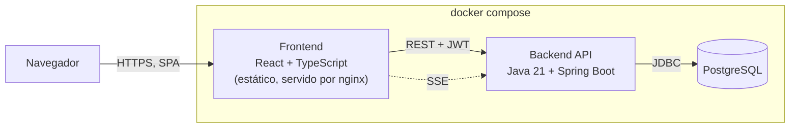
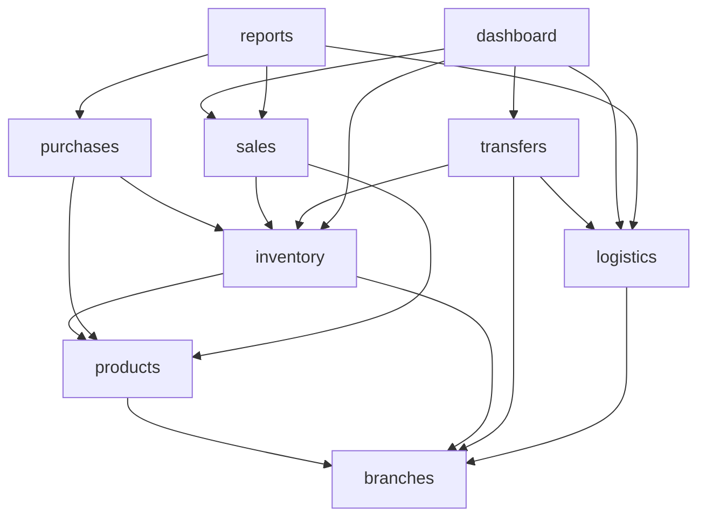
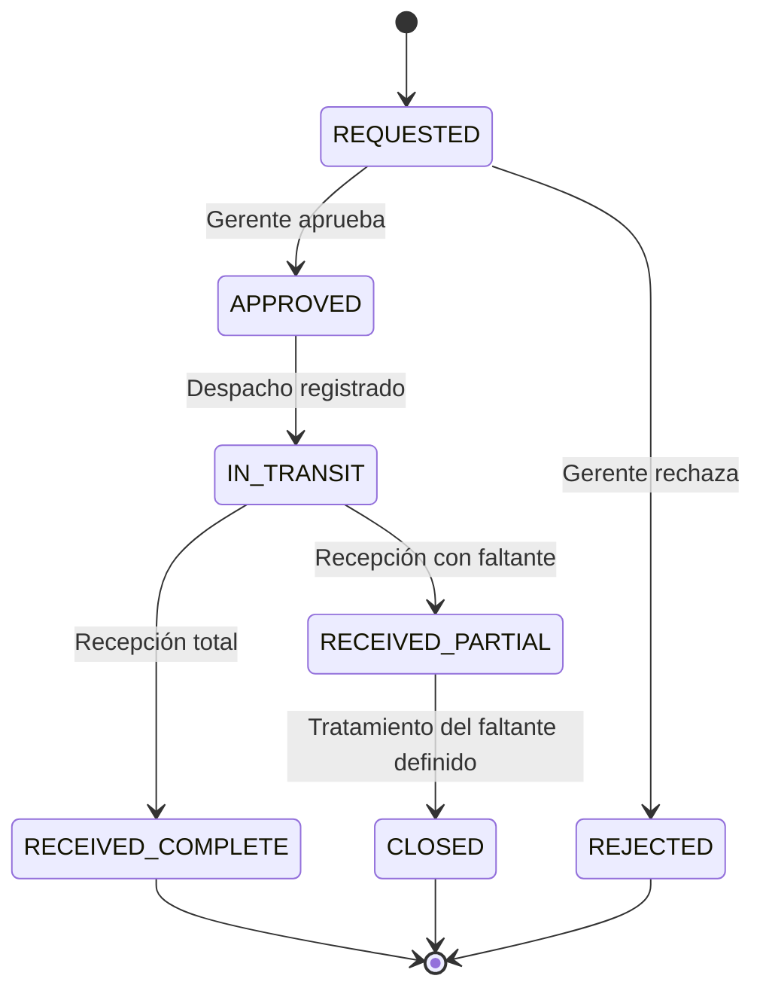

# Sistema de Inventario Multi-Sucursal

Aplicación para gestionar el inventario de una organización con varias sucursales: cada sucursal opera sus propias transacciones (compras, ventas, ajustes) de forma independiente, mientras el resto de la red mantiene visibilidad en tiempo casi real de su stock y coherencia de datos entre todas ellas.

Desarrollado como prueba técnica a partir de `private/Prueba Tecnica Inventario.pdf` (OptiPlant Consultores). La especificación completa de requisitos, con trazabilidad a cada decisión, vive en [`docs/PROJECT_BRIEF.md`](docs/PROJECT_BRIEF.md); este README resume el resultado y cómo ejecutarlo.

## Alcance implementado

Los seis módulos obligatorios de la prueba están completos, en backend y frontend, verificados de punta a punta contra PostgreSQL real:

- **Inventario** — CRUD de productos, stock por sucursal, ingresos/retiros con trazabilidad completa (fecha, responsable, motivo, cantidad), stock mínimo y alertas.
- **Compras** — órdenes a proveedor, condiciones comerciales, recepción total/parcial, costo promedio ponderado.
- **Ventas** — registro con validación de stock, listas de precios, descuentos, devoluciones, comprobante consultable.
- **Transferencias entre sucursales** — ciclo completo solicitud → aprobación → despacho → recepción (completa o parcial), con faltantes y su tratamiento (reenvío, ajuste, reclamación).
- **Logística** — clasificación de rutas, tiempos estimados vs. reales, estado de transferencias en curso, reporte de cumplimiento.
- **Dashboard** — ventas del mes vs. meses anteriores, rotación de inventario, transferencias activas, indicadores de reabastecimiento, comparativa entre sucursales (perfiles administrativos).

**Funcionalidad adicional elegida (RF-036):** alertas inteligentes de stock mínimo — se disparan automáticamente al cruzar el umbral configurado en cualquiera de las cinco operaciones que tocan stock (venta, ajuste, recepción de compra, despacho y recepción de transferencia), se notifican en tiempo casi real por SSE y se resuelven solas al reabastecerse. Detalle de diseño en **ADR-015**.

Explícitamente fuera de alcance (documentado desde el inicio, no una omisión — ver [`docs/PROJECT_BRIEF.md`](docs/PROJECT_BRIEF.md) sección 2 y 11): integración funcional con un sistema externo (RF-040, opcional), predicción de demanda, gestión de proveedores como módulo aparte, control de caducidad.

## Stack

| Capa | Tecnología |
|---|---|
| Frontend | React + TypeScript (Vite) |
| Backend | Java 21 + Spring Boot |
| Base de datos | PostgreSQL, migraciones con Flyway |
| API | REST |
| Autenticación/autorización | Spring Security + JWT + RBAC (ADMIN / MANAGER / OPERATOR) |
| Tiempo casi real | Server-Sent Events (SSE) |
| Infraestructura | Docker Compose |

Ninguna decisión de stack fue arbitraria; cada una está justificada en [`docs/DECISIONS.md`](docs/DECISIONS.md) y ampliada por un ADR dedicado en [`docs/adr/`](docs/adr/) cuando la decisión lo ameritó.

## Arquitectura y justificación

**Monolito modular**, no microservicios: el dominio (venta, recepción de compra, transferencia) es transaccionalmente cohesivo — una venta o una recepción deben ser atómicas de punta a punta, algo que microservicios convertiría en sagas/eventual consistency sin necesidad real para el volumen de esta prueba (ver **ADR-001**, `docs/DECISIONS.md` TD-005). El backend está internamente organizado en módulos con dependencias unidireccionales explícitas — ningún módulo accede a las tablas de otro directamente — de modo que un módulo podría extraerse a servicio propio el día que aparezca una necesidad concreta (`docs/ARCHITECTURE.md`, sección 10), sin que eso sea el punto de partida.





`branches`/`products` son módulos base; `dashboard`/`reports` son hojas de solo lectura que nadie más depende de ellas. `auth`/`users` son transversales (se resuelven en la capa de seguridad, no aparecen en el grafo de negocio). Detalle completo — vistas de contexto/contenedores, flujo de una petición, estrategia transaccional, por qué SSE y no WebSocket, riesgos y decisiones pospuestas — en [`docs/ARCHITECTURE.md`](docs/ARCHITECTURE.md).

**Decisiones técnicas principales** (justificación completa en `docs/DECISIONS.md` y su ADR):

- **Persistencia y concurrencia:** Spring Data JPA/Hibernate; las operaciones que compiten por el mismo stock (venta, despacho) usan bloqueo optimista (columna `version`) con reintento acotado — nunca `SELECT ... FOR UPDATE`. Las líneas de una operación multi-producto se procesan siempre en el mismo orden determinista (por `productId`), no en el orden en que llegó el payload: sin eso, dos operaciones concurrentes sobre los mismos dos productos en orden opuesto pueden producir un interbloqueo real de base de datos — se encontró y corrigió durante el desarrollo (ver `docs/TEST_STRATEGY.md`).
- **Idempotencia real:** las operaciones de creación repetible (venta, recepción de compra, solicitud de transferencia) exigen el encabezado `Idempotency-Key`; el respaldo real bajo concurrencia genuina es una restricción `UNIQUE` de base de datos, no solo la comprobación en memoria (verificado con una prueba de carrera real, no secuencial).
- **Trazabilidad append-only:** todo movimiento de inventario (`InventoryMovement`) es inmutable — nunca se edita ni se borra; una corrección se registra como un nuevo movimiento compensatorio (ADR-008).
- **Autorización por rol y por sucursal:** RBAC declarativo (`@PreAuthorize`) más una comprobación explícita de pertenencia a sucursal (`AuthorizationService`) en cada operación de escritura y en cada lectura acotada — verificado con pruebas negativas reales (acceso cruzado de sucursal, transición de estado no autorizada, IDOR de lectura/escritura), todas bloqueadas correctamente.
- **SSE, no WebSocket:** la necesidad es unidireccional (el servidor avisa que algo cambió; el cliente vuelve a pedir el dato por REST) — WebSocket sería infraestructura sin justificación concreta (ADR-007/ADR-009).

## Requisitos previos

- Docker y Docker Compose. No se necesita Java, Maven, Node ni PostgreSQL instalados localmente — todo corre dentro de los contenedores.
- Opcional, solo para desarrollo local sin Docker: Java 21 + Maven 3.9+ (backend) y Node 20+ (frontend).

## Variables de entorno

Todas están documentadas y con un valor por defecto de desarrollo en [`.env.example`](.env.example) — cópialo a `.env` antes de levantar el proyecto (`.env` está excluido de git, `.env.example` no):

| Variable | Uso | Valor de ejemplo |
|---|---|---|
| `DB_NAME` / `DB_USER` / `DB_PASSWORD` / `DB_PORT` | PostgreSQL | `inventario` / `inventario` / `changeme_local_dev_only` / `5432` |
| `BACKEND_PORT` | Puerto expuesto de la API | `8080` |
| `JWT_SECRET` | Clave de firma HS256 de los JWT — **generar una propia fuera de desarrollo local** (`openssl rand -base64 48`, mínimo 32 caracteres) | ver `.env.example` |
| `JWT_EXPIRATION_MS` | Vigencia del token (ms) | `3600000` (1 h) |
| `APP_CORS_ALLOWED_ORIGINS` | Orígenes autorizados a llamar la API desde el navegador | `http://localhost:3000` |
| `FRONTEND_PORT` | Puerto expuesto del frontend | `3000` |
| `VITE_API_BASE_URL` | URL base que el frontend usa para llamar a la API (se fija en tiempo de build del contenedor) | `http://localhost:8080/api/v1` |

El backend arranca con un `WARN` visible en sus logs si detecta que `JWT_SECRET` sigue en el valor por defecto de desarrollo — no se rechaza el arranque (rompería el flujo de un solo comando exigido más abajo), pero cualquier uso más allá de una evaluación/demo local debe sobrescribirlo.

## Levantar el proyecto

```bash
cp .env.example .env
docker compose up --build
```

Un solo comando, sin configuración manual adicional. Servicios expuestos (puertos configurables en `.env`):

| Servicio | URL por defecto |
|---|---|
| Frontend | http://localhost:3000 |
| Backend (API) | http://localhost:8080/api/v1 |
| Health check del backend | http://localhost:8080/actuator/health |
| PostgreSQL | localhost:5432 |

Para detener:

```bash
docker compose down          # conserva los datos
docker compose down -v       # además elimina el volumen de PostgreSQL
```

### Migraciones y datos de siembra

Las migraciones (Flyway, `backend/src/main/resources/db/migration/`, actualmente V1–V30) corren automáticamente al arrancar el backend contra una base vacía — no hay ningún paso manual. Incluyen un mínimo de datos de siembra necesarios para poder iniciar sesión y operar de inmediato: una sucursal, tres usuarios (uno por rol), el catálogo base de unidades de medida.

### Credenciales de demostración

**Solo para este entorno local de evaluación** — están en texto plano en una migración versionada (`V4__seed_initial_users.sql`) a propósito, para que cualquiera pueda evaluar el sistema sin pasos adicionales; por eso mismo **no deben reutilizarse fuera de esta demo**, y `JWT_SECRET` debe cambiarse en cualquier despliegue que no sea este:

| Correo | Rol | Sucursal | Contraseña |
|---|---|---|---|
| `admin@inventario.local` | ADMIN | — (alcance global) | `ChangeMe123!` |
| `gerente.centro@inventario.local` | MANAGER | Sucursal Centro | `ChangeMe123!` |
| `operador.centro@inventario.local` | OPERATOR | Sucursal Centro | `ChangeMe123!` |

### Desarrollo local sin Docker (opcional)

```bash
# Backend — requiere PostgreSQL accesible en localhost:5432 (usar las variables de .env)
cd backend
mvn spring-boot:run

# Frontend — sirve en http://localhost:5173 con recarga en caliente
cd frontend
npm install
npm run dev
```

## Módulos

| Módulo (backend) | Responsabilidad | Pantallas (frontend) |
|---|---|---|
| `auth` | Login, JWT, RBAC transversal | Login |
| `branches` | Sucursales | Sucursales (ADMIN) |
| `users` | Usuarios, rol, sucursal | Usuarios (ADMIN) |
| `products` | Catálogo, unidades de medida, listas de precios | Productos, Unidades de medida |
| `inventory` | Stock por sucursal, movimientos, alertas de stock mínimo | Inventario, Movimientos, Alertas |
| `suppliers` | Proveedores | Proveedores |
| `purchases` | Órdenes de compra, recepción, costo promedio ponderado | Compras |
| `sales` | Ventas, devoluciones | Ventas |
| `transfers` | Ciclo completo de transferencia entre sucursales | Transferencias |
| `logistics` | Rutas, cumplimiento logístico | Logística |
| `dashboard` | Indicadores agregados | Dashboard, Comparativa entre sucursales |
| `reports` | Exportación a Excel de movimientos, ventas, transferencias y cumplimiento logístico | Botón "Exportar a Excel" en Inventario/Movimientos, Ventas, Transferencias y Logística |
| `events` | Canal SSE (near-real-time) | (transversal — alimenta actualizaciones automáticas en Inventario, Alertas, Transferencias) |

## API

Contrato REST versionado bajo `/api/v1`. Documentado en dos niveles:

- [`docs/API_DESIGN.md`](docs/API_DESIGN.md) — catálogo completo de recursos y endpoints por módulo, convención de errores, reglas de idempotencia, autorización por endpoint, y ejemplos de request/response de los flujos críticos (venta, recepción de compra, ciclo completo de transferencia).
- [`docs/openapi.yaml`](docs/openapi.yaml) — especificación OpenAPI 3.0. **No es exhaustiva a propósito** (lo declara su propia sección `info`): cubre autenticación, el formato uniforme de errores y los recursos de mayor riesgo de negocio (inventario, compras + recepción, ventas, transferencias + transiciones, alertas, un endpoint de dashboard de muestra). El resto de endpoints de gestión (CRUD de sucursales, usuarios, proveedores, listas de precios, rutas, exportaciones) están documentados en prosa en `API_DESIGN.md` sección 7, no en el YAML. No hay Swagger UI servido por la aplicación; para explorar el YAML de forma interactiva, ábrelo en [editor.swagger.io](https://editor.swagger.io) o cualquier editor con soporte OpenAPI.

Toda respuesta de error usa un sobre uniforme (`code`, `message`, `status`, `requestId`, `details`) — nunca expone un stack trace ni un mensaje interno sin traducir.

## Roles

RBAC con tres roles (`docs/DECISIONS.md` TD-008), verificados por rol y por sucursal en cada endpoint — matriz completa en [`docs/USE_CASES.md`](docs/USE_CASES.md) sección 2 (auditada contra el código, no solo la intención de diseño):

| Rol | Alcance de sucursal | Puede |
|---|---|---|
| **ADMIN** | Todas | Todo lo operativo, más lo exclusivo de administración: usuarios, sucursales, listas de precios, unidades de medida, eliminar proveedores. |
| **MANAGER** | La propia (dashboard/reportes: cualquiera) | Las mismas capacidades operativas que OPERATOR (compras, ventas, transferencias) **más** aprobar/rechazar transferencias y tratar faltantes — la única acción exclusiva de este rol. |
| **OPERATOR** | La propia | Operación diaria: ajustes de inventario, compras, ventas, solicitar/despachar/recibir transferencias. No aprueba ni trata faltantes. |

Ningún rol distinto de ADMIN puede leer ni escribir sobre datos de una sucursal ajena, salvo las lecturas explícitamente abiertas por requisito (catálogo/inventario de cualquier sucursal, RF-002/RF-003) y el caso de una transferencia (visible desde su origen y su destino).

## Pruebas

| Nivel | Herramienta | Cómo correrlas | Resultado actual |
|---|---|---|---|
| Backend (unitarias + integración + API) | JUnit 5 + `TestRestTemplate`, H2 en memoria | `cd backend && mvn test` | 320 pruebas, 0 fallos (8 se omiten con gracia sin Docker disponible — ver abajo) |
| Backend contra PostgreSQL real | JUnit 5 + Testcontainers | incluidas en `mvn test` (`disabledWithoutDocker = true`) | arranque/Flyway (2) + concurrencia real (6): se ejecutan solo si hay un daemon Docker accesible desde el proceso de pruebas; si no, se omiten sin fallar el resto de la suite |
| Frontend (componentes/flujos) | Vitest + Testing Library | `cd frontend && npx vitest run` | 173 pruebas, 0 fallos |
| E2E (flujos completos, navegador real) | Playwright, contra `docker compose up` ya corriendo | `cd e2e && npm install && npx playwright install chromium && npm test` | 4 flujos, 0 fallos — ver `e2e/README.md` |

**Qué prueba cada nivel** — estrategia completa, matriz riesgo × prueba por módulo, y por qué cada nivel existe (no perseguir % de cobertura como meta aislada) en [`docs/TEST_STRATEGY.md`](docs/TEST_STRATEGY.md).

Los 4 flujos E2E mínimos, cada uno verificado en verde contra el stack real (navegador Chromium real, PostgreSQL real):

- **A** — login → registrar compra → verificar inventario.
- **B** — login → venta → verificar decremento y movimiento.
- **C** — solicitar transferencia → despachar → recibir → verificar ambos inventarios.
- **D** — recepción parcial → faltante visible.

Las pruebas de concurrencia usan hilos reales (`ExecutorService`/`CountDownLatch`), no llamadas HTTP secuenciales: dos ventas simultáneas por el último stock, venta vs. despacho de transferencia compitiendo por el mismo stock, doble despacho/recepción de la misma transferencia, reintento con el mismo `Idempotency-Key` en una carrera genuina, y el escenario que expuso el interbloqueo real ya corregido (ver arriba).

## Diagramas

- Contexto, contenedores, grafo de dependencias entre módulos, flujo de una petición (secuencia) — [`docs/ARCHITECTURE.md`](docs/ARCHITECTURE.md).
- Modelo entidad-relación completo, regenerado desde el esquema real aplicado por Flyway (no desde el diseño previo a la implementación) — [`docs/DOMAIN_MODEL.md`](docs/DOMAIN_MODEL.md) sección 5.
- Máquina de estados de una transferencia:



## Limitaciones y deuda conocida

Documentadas explícitamente, no descubiertas por accidente por quien evalúe:

- **Sin revocación de JWT.** Autenticación stateless (ADR-005, decisión deliberada): desactivar un usuario no invalida un token ya emitido hasta que expire de forma natural (por defecto, 1 hora) — mitigado con una vigencia corta, no con una lista de revocación (quedaría como trabajo futuro si se necesitara revocación inmediata).
- **`GET /inventory-movements` no está acotado por sucursal** (cualquier rol autenticado puede consultar el histórico de movimientos de cualquier sucursal) — coincide con RF-002/RF-003 (visibilidad de inventario abierta entre sucursales de la misma red), pero es más permisivo que su propio endpoint de exportación (`/reports/inventory-movements/export`), que sí está acotado; queda señalado para reconciliar si el negocio decide que debería serlo también.
- **Tolerancia de precio en la recepción de compra es un valor provisional** (rechaza si el costo declarado se aleja más de 3× del pactado en la orden) — evita que un error de tecleo corrompa el costo promedio ponderado, pero el umbral exacto es una decisión de negocio pendiente de confirmar, no algo que el código deba decidir por sí solo.
- **`SaleStatus.VOIDED`** (anular una venta por completo, más allá de la devolución parcial ya implementada) sigue como decisión de modelo de dominio pendiente de aprobación — no implementado para no presentar como resuelta una decisión que no lo está.
- **Actor "Sistema externo" (RF-040)** — opcional según el enunciado; la API REST no lo impide a futuro, pero no hay una integración ERP/POS construida en esta entrega.
- **Sin stack de observabilidad más allá de logging estructurado y health check** (sin métricas/tracing distribuido) — piso mínimo razonable para el alcance de esta prueba, documentado como mejora futura si el volumen lo justificara.
- **PostgreSQL como instancia única**, sin réplica ni failover — aceptable para el alcance de evaluación/demo de esta entrega.

## Funcionalidad adicional

Alertas inteligentes de stock mínimo (RF-010/RF-036, la funcionalidad adicional elegida entre las obligatorias del enunciado) — ver "Alcance implementado" arriba y **ADR-015** para el detalle completo de diseño (condición de disparo, deduplicación, alcance, notificación).

## Documentación

Todo el proceso de diseño — requisitos con trazabilidad, arquitectura, modelo de dominio, reglas de negocio, flujos críticos, contrato de API, decisiones técnicas, estado del proyecto fase a fase — vive en [`docs/`](docs/). El uso de asistencia de IA durante el desarrollo, con ejemplos concretos de dirección y validación humana, está documentado en [`docs/AI_USAGE.md`](docs/AI_USAGE.md).
