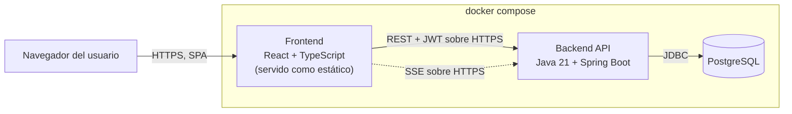
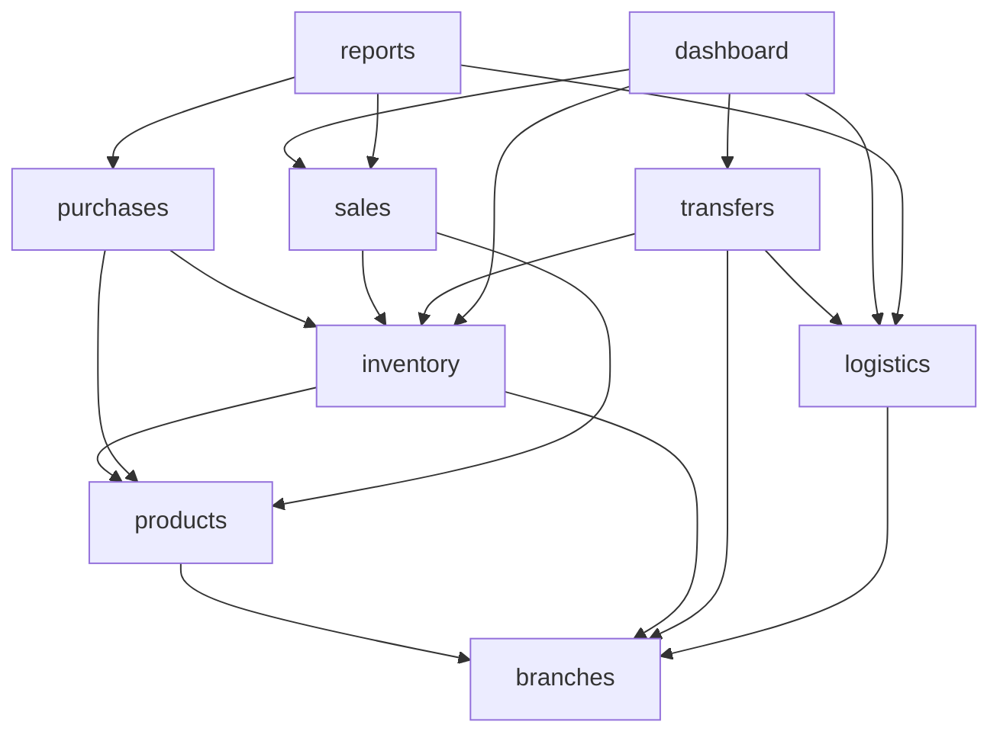

# Arquitectura Técnica

**Sistema de Inventario Multi-Sucursal**

**Base de este documento:** `docs/PROJECT_BRIEF.md` (requisitos y NFRs aprobados), `docs/USE_CASES.md` (actores y flujos), `docs/DECISIONS.md` (TD-001 a TD-008, ya aprobadas y congeladas). Este documento no reabre esas decisiones — las aplica y explica su encaje arquitectónico concreto (transacciones, concurrencia, capas, evolución).

**Fecha:** 2026-08-26.

**Decisiones congeladas que enmarcan este diseño:** React + TypeScript · Java 21 + Spring Boot · PostgreSQL · REST · Monolito modular · Spring Security + JWT + RBAC · Docker Compose.

No se define aquí estructura de repositorio, nombres de clases ni código. Eso corresponde a una fase posterior de implementación.

---

## 1. Vista de contexto

Actores (definidos en `USE_CASES.md`) interactúan con el sistema exclusivamente a través del navegador; no hay acceso directo a la base de datos ni al backend fuera de la API.

```mermaid
graph TB
    Admin["Administrador general"]
    Gerente["Gerente de sucursal"]
    Operador["Operador de inventario"]
    ExtSys["Sistema externo (opcional, no implementado)"]
    Sistema(("Sistema de Inventario<br/>Multi-Sucursal"))

    Admin -->|usa vía navegador| Sistema
    Gerente -->|usa vía navegador| Sistema
    Operador -->|usa vía navegador| Sistema
    ExtSys -.->|futuro, vía API REST| Sistema
```

El "Sistema externo" se representa con línea punteada porque es un actor opcional (RF-040) sin implementación en este alcance (ver `PROJECT_BRIEF.md`, sección 2). Su inclusión en el contexto es deliberada: la arquitectura no debe impedirlo a futuro, aunque hoy no exista ningún endpoint expuesto para él.

## 2. Vista de contenedores

Tres contenedores Docker independientes, orquestados por Docker Compose (RT-003), cada uno con un único proceso y responsabilidad:



- **Frontend:** SPA en React + TypeScript, compilada a estáticos y servida por su propio contenedor. No contiene lógica de negocio (RT-002); solo composición de UI, enrutamiento de pantallas y llamadas a la API.
- **Backend API:** único proceso Spring Boot que expone la API REST y el canal SSE. Internamente organizado en módulos (sección 3), pero es un solo artefacto desplegable — monolito modular, no varios servicios.
- **PostgreSQL:** una única instancia/contenedor de base de datos para todo el dominio. Todos los módulos del backend comparten la misma base de datos física, con separación lógica por tablas (y, si conviene en la fase de modelo de datos, por schema).
- Cada contenedor puede reconstruirse, reiniciarse y escalarse (verticalmente, para el alcance de esta prueba) de forma independiente, sin acoplar el ciclo de vida de uno a otro.

## 3. Módulos internos del backend y responsabilidades

El backend se organiza en los módulos ya establecidos en `CLAUDE.md`. Cada módulo aplica, cuando aporta valor, la misma separación interna: **capa de entrada (controladores REST + DTOs)** → **capa de aplicación (servicios, orquestación de casos de uso, límite transaccional)** → **capa de dominio (invariantes y reglas propias del módulo, cuando el módulo las tiene)** → **capa de persistencia (repositorios Spring Data JPA + entidades)**. No se introduce una capa de dominio rica donde el módulo es un CRUD simple, para evitar ceremonias innecesarias (p. ej. `products` puede no necesitarla; `transfers` sí, por su máquina de estados).

| Módulo | Responsabilidad principal | Requisitos que cubre |
|---|---|---|
| `auth` | Autenticación (login, emisión/validación de JWT) y aplicación de autorización RBAC transversal. | RNF-003 |
| `users` | Gestión de usuarios, asignación de rol y sucursal. | RF-037, RF-039 |
| `branches` | Gestión de sucursales (alta, edición, estado activo/inactivo). | RF-001, RF-037 |
| `products` | Catálogo de productos, unidades de medida, listas de precios. | RF-005, RF-006, RF-011, RF-020 |
| `inventory` | Stock por producto/sucursal, movimientos (ingresos/retiros), trazabilidad, stock mínimo y alertas. | RF-002, RF-003, RF-007 a RF-010, RF-036 |
| `purchases` | Órdenes de compra, condiciones comerciales, recepción, costo promedio ponderado. | RF-012 a RF-016 |
| `sales` | Registro de ventas, validación de stock, descuentos, comprobantes. | RF-017 a RF-021 |
| `transfers` | Ciclo completo de transferencia: solicitud, aprobación, preparación, despacho, recepción (completa/parcial), faltantes. | RF-022 a RF-026 |
| `logistics` | Tiempos estimados/reales, clasificación de rutas, estado de transferencias en curso, reportes de cumplimiento. | RF-027 a RF-030 |
| `dashboard` | Agregación de indicadores para visualización (ventas, rotación, transferencias activas, reabastecimiento, comparativa entre sucursales). | RF-031 a RF-035 |
| `reports` | Reportes de cumplimiento logístico y otros reportes transversales de solo lectura. | RF-030 |

`auth` y `users` son transversales: todos los demás módulos los consumen para resolver identidad y permisos, pero no los llaman como parte de su lógica de negocio — la autorización se resuelve en la capa de entrada (filtro de seguridad + anotaciones de método), no dentro de cada servicio de dominio.

## 4. Dependencias permitidas entre módulos

Regla general: **las dependencias fluyen en una sola dirección, de los módulos operativos hacia los módulos de agregación/consulta, nunca al revés.** Ningún módulo accede a las tablas de otro módulo directamente (RNF, sección 4.7 de `PROJECT_BRIEF.md`); si un módulo necesita datos de otro, lo hace a través de su capa de servicio (llamada interna Java, no HTTP, dado que es un monolito).



- `branches` y `products` son módulos base: no dependen de ningún otro módulo de negocio.
- `inventory` depende de `products` y `branches`, pero **no** depende de `purchases`, `sales` ni `transfers` — es al revés: esos tres orquestan `inventory` para registrar sus movimientos. Esto evita que `inventory` conozca "por qué" ocurre un movimiento más allá del motivo que se le pasa (compra, venta, ajuste, transferencia), manteniéndolo cohesivo y reutilizable.
- `dashboard` y `reports` son hojas del grafo: solo leen de otros módulos (consultas agregadas, nunca escritura) y ningún módulo depende de ellos. Esto es intencional — permite que el día de mañana se optimicen o incluso se extraigan sin arriesgar la operación transaccional del resto (ver sección 10).
- `auth` y `users` no aparecen en el grafo porque no son dependencias de negocio: se resuelven en la capa de entrada (seguridad) y, cuando un módulo necesita el nombre de un responsable, solo referencia su identificador de usuario, no llama al servicio de `users` en medio de una transacción de negocio.
- Prohibido explícitamente: dependencias circulares entre módulos operativos, y que `inventory`/`products`/`branches` dependan de módulos de orden superior (`purchases`, `sales`, `transfers`, `dashboard`, `reports`).

## 5. Flujo de una petición: de React a PostgreSQL

Ejemplo con una operación de escritura típica (registrar una venta); una consulta de lectura sigue el mismo camino sin el paso de commit de escritura.

```mermaid
sequenceDiagram
    participant U as Usuario (navegador)
    participant FE as React SPA
    participant SEC as Spring Security (filtro JWT)
    participant C as Controller (capa de entrada)
    participant S as Service (capa de aplicación)
    participant D as Reglas de dominio
    participant R as Repository (Spring Data JPA)
    participant PG as PostgreSQL

    U->>FE: Acción de negocio (p. ej. confirmar venta)
    FE->>SEC: POST /api/... + Authorization: Bearer <JWT>
    SEC->>SEC: Valida firma y expiración del JWT; resuelve rol
    SEC->>C: Request autenticado, rol en contexto de seguridad
    C->>C: Valida forma del payload (Bean Validation en el DTO)
    C->>S: Invoca el caso de uso con el DTO validado
    S->>S: Abre límite transaccional (@Transactional)
    S->>D: Aplica reglas de negocio (stock disponible, permisos por sucursal)
    D-->>S: OK o excepción de negocio
    S->>R: Persiste cambios (movimiento de inventario, venta)
    R->>PG: SQL vía Hibernate (INSERT/UPDATE)
    PG-->>R: Confirmación
    R-->>S: Entidades persistidas
    S-->>C: DTO de salida
    C-->>FE: Respuesta HTTP (200/201 o error de negocio)
    FE-->>U: Actualiza la interfaz
```

Puntos clave del flujo:

- El frontend nunca construye SQL ni conoce el modelo de datos; solo conoce el contrato REST (DTOs).
- La validación ocurre en dos niveles distintos y con propósitos distintos: forma del dato en el Controller (¿el campo existe, tiene el tipo correcto?) y reglas de negocio en el Service/dominio (¿hay stock suficiente?, ¿el usuario tiene permiso sobre esa sucursal?).
- El límite transaccional se abre en la capa de aplicación (Service), nunca en el Controller ni en el Repository de forma aislada, para que toda la operación de negocio sea atómica (sección 7).

## 6. Ubicación de reglas de negocio y validaciones

- **Frontend (React):** únicamente validación de UX (campo requerido, formato) para dar retroalimentación inmediata. Nunca es la fuente de verdad; el backend repite toda validación relevante, porque el frontend puede ser evadido (RT-002).
- **Capa de entrada (Controller/DTO):** validación estructural — tipos, formato, campos obligatorios — mediante Bean Validation. No conoce reglas de negocio del dominio (no valida "hay stock suficiente").
- **Capa de aplicación (Service):** orquesta el caso de uso y aplica las reglas de negocio que dependen de estado y de más de una entidad: validar stock antes de confirmar venta (RF-019), validar permisos por sucursal, decidir si una recepción es completa o parcial, disparar el recálculo de costo promedio ponderado (RF-016).
- **Capa de dominio (cuando existe):** invariantes que no dependen de infraestructura — por ejemplo, que una transferencia no pueda pasar de "solicitada" a "recibida" sin pasar por "en tránsito" (máquina de estados, pendiente de definir en fase de modelo de dominio), o que un movimiento de inventario no pueda tener cantidad negativa. Se modela como objetos de dominio solo donde la complejidad lo justifica (`transfers`, `inventory`); en módulos simples (`branches`, `products`) la validación vive directamente en el servicio.
- **Base de datos (PostgreSQL):** última línea de defensa, no la primera. Constraints (`NOT NULL`, `CHECK`, `FOREIGN KEY`, `UNIQUE`) protegen la integridad incluso ante un error de programación en el backend, pero no reemplazan la validación de negocio explícita en el Service.

Ninguna regla de negocio vive en el frontend ni en la base de datos como única defensa — ambas son complementarias a la capa de aplicación/dominio del backend, que es la autoridad.

## 7. Estrategia transaccional

- Cada caso de uso que modifica estado (venta, recepción de compra, paso del flujo de transferencia, ajuste de inventario) se ejecuta dentro de una única transacción de base de datos, delimitada con `@Transactional` a nivel del método de servicio de aplicación — nunca a nivel de Controller ni repartida entre varias llamadas de repositorio sin una transacción que las englobe.
- **Aislamiento:** se parte del nivel por defecto de PostgreSQL/Spring (`READ COMMITTED`), suficiente para la mayoría de las lecturas del sistema (catálogo, dashboard, histórico).
- **Concurrencia sobre el mismo stock** (el riesgo de dominio más crítico, ya identificado en `PROJECT_BRIEF.md` sección 9): dos ventas simultáneas sobre el mismo producto/sucursal no deben poder dejar el stock en negativo ni confirmarse ambas si solo hay existencia para una.
  - Mecanismo previsto: bloqueo optimista (columna de versión) sobre el registro de stock agregado por producto/sucursal, con reintento controlado ante conflicto de versión; para el volumen esperado en esta prueba (RNF-004), el bloqueo optimista es suficiente y no penaliza el rendimiento de lecturas concurrentes.
  - Si en la fase de flujos críticos se detecta un punto de contención real (p. ej. un producto con altísima frecuencia de venta simultánea), se evaluará bloqueo pesimista (`SELECT ... FOR UPDATE`) puntual sobre esa operación — decisión pospuesta a esa fase, no se generaliza a priori.
- **Operaciones que cruzan dos sucursales** (una transferencia despacha desde el origen y recibe en el destino): cada paso del flujo (RF-023 a RF-026) es su propia transacción local — no existe una transacción distribuida entre "origen" y "destino" porque ambos residen en la misma base de datos PostgreSQL; la atomicidad se logra dentro de esa única base, no entre servicios.
- Ninguna llamada a un sistema externo (correo, SSE, notificación) ocurre dentro del límite transaccional de escritura — se dispara después de confirmar el commit, para no bloquear ni arriesgar la transacción de negocio por la disponibilidad de un canal secundario.

## 8. Estrategia de errores y observabilidad

- **Manejo de errores:** un manejador global de excepciones (`@ControllerAdvice` a nivel de la capa de entrada) traduce las excepciones de negocio (stock insuficiente, transferencia en estado inválido, permiso denegado) a respuestas HTTP consistentes y con estructura uniforme (código, mensaje, referencia del recurso). Se distingue explícitamente entre errores de validación/negocio (4xx) y errores no controlados (5xx).
- **Logging:** logging estructurado de cada operación de negocio crítica (venta confirmada, compra recibida, transferencia despachada/recibida) incluyendo sucursal, usuario responsable y resultado — reforzando la auditabilidad ya exigida por RF-009, no duplicándola: el log es para diagnóstico operativo, el movimiento persistido en base de datos es el registro auditable de negocio.
- **Correlación:** cada request recibe/propaga un identificador de correlación (trace id) que se incluye en los logs, para poder seguir una operación de punta a punta ante un incidente.
- **Salud del servicio:** un endpoint de verificación de salud (health check) por servicio, mínimo suficiente para que Docker Compose y un operador humano puedan saber si el backend/BD están disponibles.
- **Explícitamente fuera de alcance por ahora:** stack de métricas/tracing distribuido (Prometheus, Grafana, OpenTelemetry) — no se introduce sin una necesidad concreta (consistente con el principio de evitar infraestructura sin justificación de `CLAUDE.md`). El logging estructurado y el health check son el piso mínimo razonable para una prueba técnica; se documenta como decisión pospuesta si el proyecto creciera (sección "Decisiones pospuestas").

## 9. Comunicación near-real-time: cuándo SSE y cuándo no

**Cuándo se usa SSE:**

- Para notificar a un cliente conectado que **algo cambió** y debe refrescar su vista — cambios de stock en otras sucursales (RF-002, RNF-001) y nuevas alertas de stock mínimo (RF-010, RF-036).
- Es unidireccional (servidor → cliente), que es exactamente la necesidad real: el servidor informa, el cliente no necesita enviar datos por ese mismo canal.
- Funciona sobre HTTP estándar (una conexión larga), sin protocolo adicional, con reconexión automática nativa del navegador (`EventSource`) y buen soporte en Spring (`SseEmitter`) — no añade infraestructura nueva a Docker Compose.
- El evento SSE es una **señal ligera** ("el inventario de la sucursal X cambió", "hay una nueva alerta"), no el payload completo de negocio: el cliente, al recibir la señal, vuelve a consultar la API REST para obtener el dato autoritativo. Esto evita duplicar la fuente de verdad entre dos canales y mantiene a REST + PostgreSQL como único origen de datos consistente.

**Cuándo NO se usa SSE (se usa REST normal):**

- Para cualquier consulta iniciada por el usuario (abrir el catálogo, abrir el dashboard, generar un reporte) — es un patrón de solicitud/respuesta (pull), no de notificación continua; SSE no aporta valor ahí.
- Para exportación de reportes o consultas de histórico — son operaciones puntuales, no eventos en tiempo real.
- Para cualquier acción que requiera respuesta bidireccional inmediata (confirmar una venta, aprobar una transferencia) — eso siempre es una petición REST con su propia respuesta síncrona, nunca se modela como un mensaje por el canal SSE.

**Cuándo se justificaría WebSocket en lugar de SSE:** únicamente si apareciera una necesidad real de que el cliente también envíe datos de forma continua por el mismo canal persistente (p. ej. edición colaborativa en tiempo real de una misma solicitud de transferencia por dos usuarios a la vez). Ningún requisito actual (`PROJECT_BRIEF.md`, `USE_CASES.md`) presenta esa necesidad — toda escritura del cliente ya ocurre por REST. Introducir WebSocket hoy sería infraestructura sin justificación concreta, contrario a las reglas del proyecto.

## 10. Cómo esta arquitectura evoluciona sin microservicios prematuros

- Los módulos ya están delimitados por responsabilidad (sección 3) y por dependencias unidireccionales explícitas (sección 4), como si fueran servicios independientes que hoy se comunican con llamadas Java directas en lugar de HTTP. Este patrón ("monolito modular"/*modulith*) es justamente lo que permite, el día que aparezca una necesidad concreta, extraer un módulo sin rediseñar la lógica de negocio: solo se cambia el mecanismo de invocación (de llamada interna a llamada de red) detrás de la misma interfaz de servicio.
- Ningún módulo accede a las tablas de otro directamente (sección 4), lo que significa que la base de datos ya está lógicamente particionada por dominio, aunque hoy sea una sola instancia física de PostgreSQL. Separar físicamente el almacenamiento de un módulo extraído sería un cambio de configuración, no de modelo.
- El contrato entre frontend y backend ya es una API REST versionable (RT-002, TD-004); si un módulo se extrae a su propio servicio, el frontend no tiene por qué notar el cambio, siempre que el API Gateway/enrutamiento (a definir en ese momento) preserve las mismas rutas.
- Se evita deliberadamente introducir hoy la complejidad operativa de microservicios (descubrimiento de servicios, transacciones distribuidas/sagas, mensajería asíncrona) porque el dominio actual es transaccionalmente cohesivo (una venta, una recepción de compra o un paso de transferencia deben ser atómicos) y el volumen/equipo de esta prueba no lo requiere — exactamente el argumento ya registrado en `DECISIONS.md` TD-005.

## Justificación explícita de las decisiones congeladas (en el contexto de esta arquitectura)

Estas decisiones ya están aprobadas en `DECISIONS.md`; aquí se explica su encaje específico con el diseño descrito arriba, no se reabre la elección.

- **Spring Boot** para reglas, transacciones y seguridad: `@Transactional` declarativo es exactamente el mecanismo que sostiene la sección 7 (atomicidad de venta/compra/transferencia); Spring Security con soporte nativo de JWT y autorización por anotación (`@PreAuthorize`) resuelve RBAC (sección 4 de `PROJECT_BRIEF.md`, RNF-003) sin construir un framework de autorización propio; Bean Validation resuelve la validación estructural de la sección 6 con anotaciones declarativas, reduciendo código repetido en 11 módulos.
- **PostgreSQL** para modelo relacional, integridad y concurrencia: el dominio es altamente relacional (sucursal–producto–movimiento–compra–venta–transferencia, todos con relaciones de clave foránea claras); las restricciones `CHECK`/`FOREIGN KEY`/`UNIQUE` son la última línea de defensa de la sección 6; el bloqueo optimista/pesimista de la sección 7 depende directamente de las garantías `ACID` y del control de concurrencia por fila que PostgreSQL ofrece de forma madura — una base NoSQL obligaría a reconstruir esas garantías a mano.
- **REST** por simplicidad y contratos claros: el dominio se modela naturalmente como recursos (productos, movimientos, órdenes de compra, ventas, transferencias) con operaciones CRUD y de transición de estado bien definidas — exactamente lo que REST expresa sin capas adicionales; combina de forma directa con SSE (mismo protocolo HTTP, sección 9) y con el manejo de errores por código de estado de la sección 8, sin necesitar un esquema de resolución de errores propio como exigiría GraphQL.
- **Monolito modular** por cohesión del dominio y menor complejidad operativa: las operaciones críticas del negocio (sección 7) son transaccionalmente atómicas dentro de un mismo proceso/base de datos; separar esos módulos en servicios distintos hoy obligaría a resolver con sagas o eventual consistency algo que ahora es una simple transacción SQL — complejidad no justificada por el volumen ni el equipo de esta prueba (ver señales de extracción más abajo).
- **React + TypeScript** para una SPA administrativa modular y tipada: el frontend es, en esencia, formularios, tablas, filtros y un dashboard (`DECISIONS.md` TD-001) — el modelo de componentes de React encaja con la organización por módulo del dominio (una vista por módulo: inventario, compras, ventas, transferencias, logística, dashboard), y TypeScript obliga a que los DTOs del contrato REST (sección 5) se reflejen como tipos explícitos en el cliente, deteniendo en tiempo de compilación buena parte de los errores de integración frontend-backend que de otro modo solo aparecerían en runtime.

## Riesgos y compensaciones

| Riesgo | Compensación / mitigación |
|---|---|
| Concurrencia sobre el mismo stock (ventas o despachos simultáneos) | Bloqueo optimista con reintento en el agregado de stock; transacción atómica por operación (sección 7). |
| El monolito modular degenera en un "big ball of mud" si no se respetan los límites de módulo | Reglas explícitas de dependencia unidireccional (sección 4) verificables en revisión de código; ningún acceso cruzado a tablas de otro módulo. |
| SSE con muchas conexiones abiertas simultáneamente puede consumir recursos del único proceso backend | Aceptable para el volumen de esta prueba (RNF-004, decenas de usuarios); si creciera, se evaluaría separar el canal de notificaciones — no se resuelve ahora (ver decisiones pospuestas). |
| PostgreSQL como instancia única es un punto único de fallo | Aceptable para el alcance de prueba/demo; no se introduce réplica ni failover sin una necesidad de producción real, para no sobrearquitecturar. |
| JWT es stateless: si se desactiva un usuario, su token sigue siendo válido hasta expirar | Tiempos de expiración cortos por defecto; una lista de revocación explícita queda como decisión pospuesta si se requiere revocación inmediata. |
| Ausencia de un stack de observabilidad más allá de logging/health-check dificulta diagnosticar un incidente complejo | Aceptado como piso mínimo razonable para el alcance; documentado como mejora futura, no como deuda oculta. |

## Decisiones pospuestas

Estas decisiones no bloquean el diseño actual pero deben resolverse en fases posteriores (modelo de dominio, flujos críticos o implementación):

- Estrategia exacta de locking por operación crítica (optimista generalizado vs. pesimista puntual) — se define en la fase de flujos críticos, con casos numéricos concretos.
- Herramienta de migración de esquema (Flyway vs. Liquibase), ya señalada como pendiente en `STATUS.md`.
- Organización física de tablas en PostgreSQL (un solo schema vs. schemas separados por módulo) — no bloqueante para el diseño lógico ya descrito en la sección 4.
- Política de expiración y eventual revocación de JWT.
- Diseño concreto del endpoint/mecanismo para el actor "Sistema externo" (RF-040), si se decide implementarlo — hoy solo se garantiza que la arquitectura no lo impide.
- Ampliación del stack de observabilidad (métricas, tracing distribuido) más allá de logging estructurado y health-check.
- Máquina de estados definitiva de una transferencia (transiciones válidas/inválidas) — se define junto con el modelo de dominio (`DOMAIN_MODEL.md`, pendiente).

## Señales concretas para extraer un módulo a servicio independiente

La arquitectura actual es deliberadamente monolítica (sección 10). Estas son las señales que, de aparecer, justificarían reabrir esa decisión para un módulo específico — no se cumple ninguna hoy:

1. El módulo requiere un patrón de escalado o una tecnología de cómputo radicalmente distinta a la del resto (p. ej. `dashboard`/`reports` necesitan cargas analíticas pesadas que compiten por recursos con las operaciones transaccionales de `sales`/`inventory`).
2. El módulo necesita un ciclo de despliegue con una cadencia mucho más alta o independiente del resto (equipo dedicado, releases frecuentes que hoy forzarían redeployar todo el monolito).
3. El volumen de datos o tráfico de un módulo crece de forma desproporcionada y requiere un motor de almacenamiento distinto al relacional (p. ej. búsqueda de texto para `products`, series de tiempo para `logistics`).
4. Surge una necesidad real de que otro sistema, fuera de este frontend, reutilice un módulo (p. ej. `inventory`) de forma independiente — más allá del actor opcional "Sistema externo" ya contemplado vía API.
5. El equipo de desarrollo crece lo suficiente como para que el costo de coordinación dentro de un único repositorio/despliegue supere el costo operativo de mantener servicios separados.
6. Se necesita aislar el radio de fallo: un incidente en un módulo no crítico (p. ej. `dashboard`) está degradando la disponibilidad de operaciones críticas (`sales`, `inventory`) por compartir el mismo proceso.

Mientras ninguna de estas señales se materialice con evidencia concreta, el monolito modular se mantiene — es la aplicación directa del principio "no introducir microservicios sin demostrar un problema concreto" ya establecido en `CLAUDE.md`.

---

**Documentos relacionados:** `docs/DECISIONS.md` (justificación general de cada tecnología), `docs/PROJECT_BRIEF.md` (requisitos y NFRs que este diseño satisface), `docs/USE_CASES.md` (actores y flujos que originan los ejemplos de esta arquitectura), `docs/BUSINESS_RULES.md` (reglas de negocio referenciadas en la sección 6).
