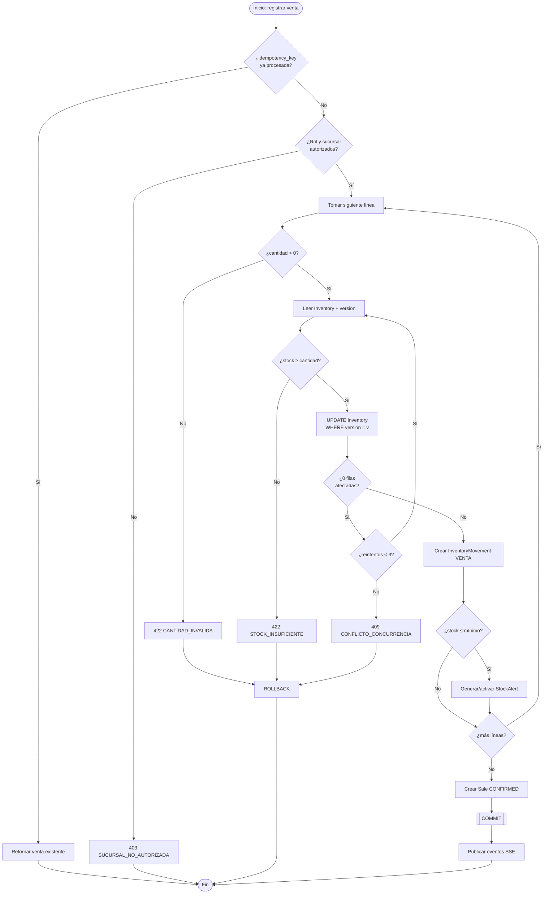
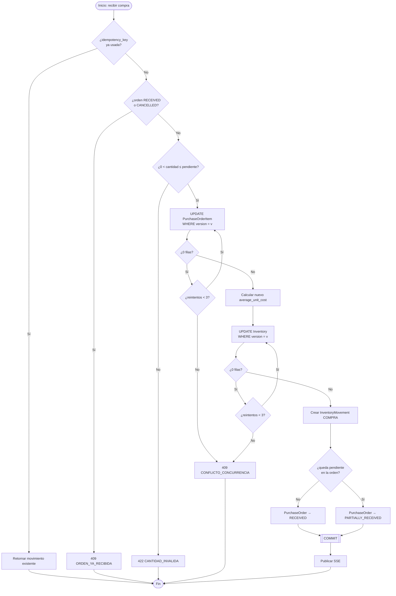
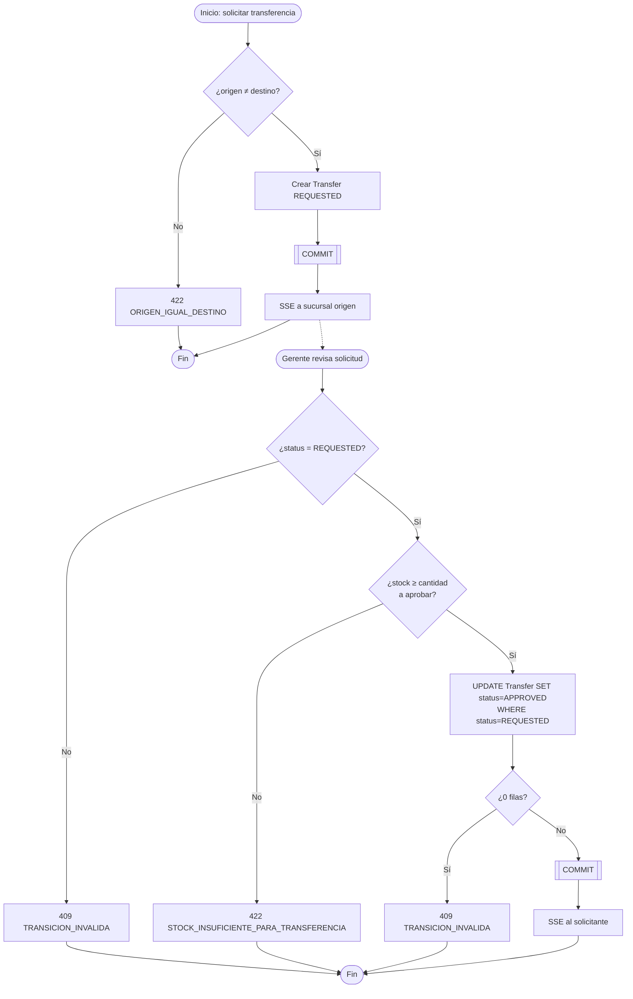
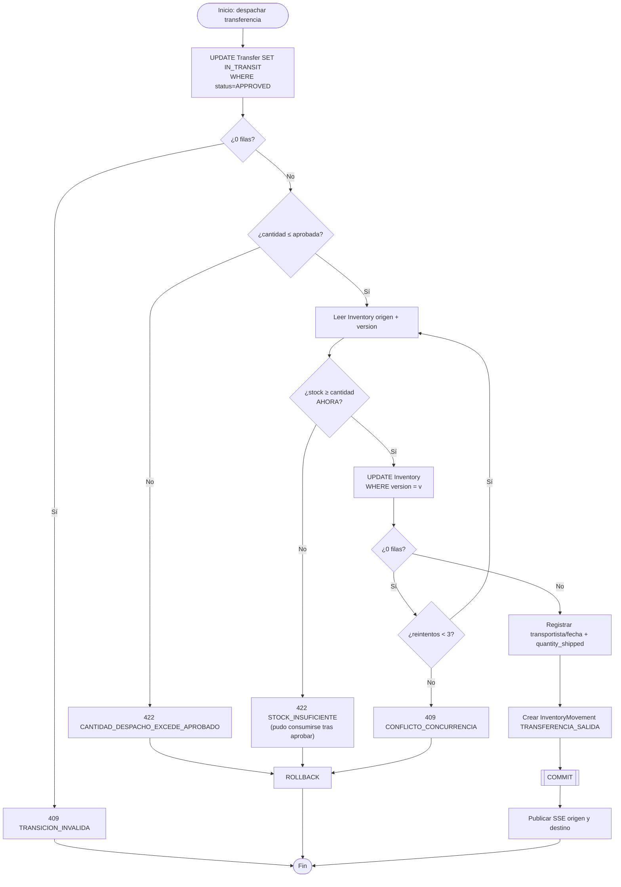
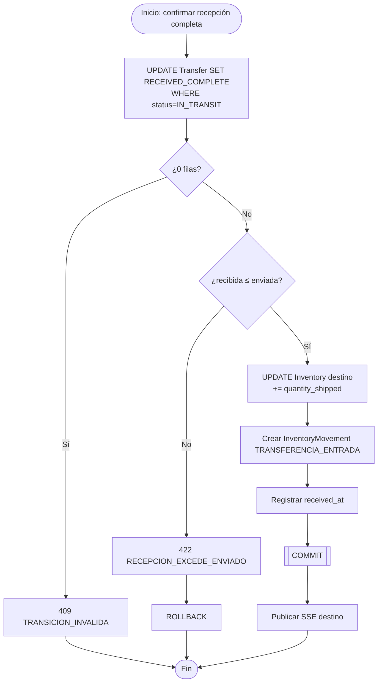
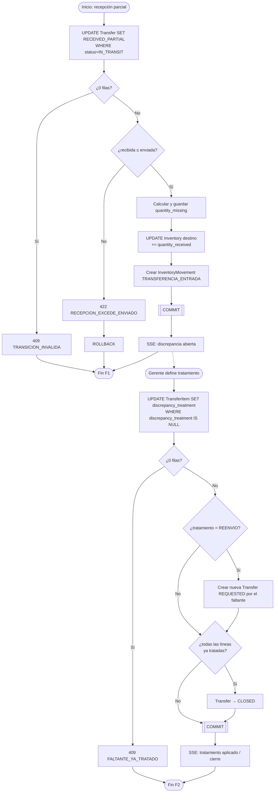
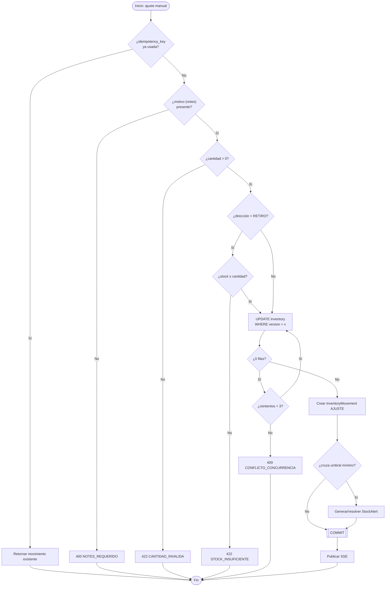

# Flujos Críticos

**Sistema de Inventario Multi-Sucursal**

**Base de este documento:** `docs/DOMAIN_MODEL.md`, `docs/BUSINESS_RULES.md`, `docs/ARCHITECTURE.md` (secciones 6 y 7), `docs/USE_CASES.md`.

**Fecha:** 2026-08-26. Este documento detalla, en pseudocódigo y diagramas de actividad, **cómo** se ejecutan las reglas ya aprobadas en `docs/BUSINESS_RULES.md`. No sustituye ese catálogo — lo hace operativo paso a paso. No se escribe código Java ni de ningún lenguaje real; el pseudocódigo es notación de diseño.

---

## 1. Principios transversales (aplican a todos los flujos)

Se explican una sola vez aquí para no repetirlos en cada flujo; cada flujo solo referencia cuál aplica.

### 1.1 Dos categorías de idempotencia

No todas las operaciones críticas se protegen igual — depende de si la operación es una **transición de estado de un recurso ya existente** o la **creación de un nuevo registro**:

- **Categoría 1 — Transición de estado, de un solo uso (state-guard):** aprobar/rechazar una transferencia, despachar, confirmar recepción completa/parcial, cerrar tras tratamiento. Se protege con un `UPDATE ... WHERE status = <estado_esperado>` (comparación-y-escritura atómica a nivel de SQL). Si la fila ya cambió de estado (por la propia petición procesada antes, o por un reintento HTTP concurrente), el `UPDATE` afecta cero filas y la aplicación responde `409` — **no requiere una clave de idempotencia enviada por el cliente**, porque el propio estado del recurso es la guarda.
- **Categoría 2 — Creación o evento repetible (idempotency key):** registrar una venta, confirmar una recepción de compra (que admite varias recepciones parciales legítimas sobre la misma orden) y un ajuste manual de inventario. Aquí el estado del recurso **no** distingue por sí solo "esta es la siguiente operación legítima" de "esto es un reintento accidental de la anterior" — se requiere que el cliente envíe una clave de idempotencia (`idempotency_key`, generada una vez por acción de usuario, p. ej. al pulsar el botón) y que el servidor la persista con una restricción `UNIQUE`, devolviendo el resultado ya creado si la clave se repite, en vez de aplicar el efecto dos veces.

### 1.2 Concurrencia: bloqueo optimista sobre agregados numéricos

Toda fila que se **lee, se modifica en función de su valor actual, y se vuelve a escribir** (no solo se transiciona de estado) usa bloqueo optimista mediante una columna `version`: `Inventory.quantity_on_hand`/`average_unit_cost` y, según se identifica en la sección 5, `PurchaseOrderItem.quantity_received`. El patrón es siempre:

```
leer fila y su version actual (v)
calcular nuevo valor
UPDATE tabla SET valor = nuevo_valor, version = v + 1 WHERE id = ? AND version = v
SI filas_afectadas = 0:
    reintentar desde "leer fila" (máximo 3 intentos)
    SI se agotan los reintentos: error 409 CONFLICTO_CONCURRENCIA
```

Tres intentos con un backoff aleatorio corto (decenas de milisegundos) es suficiente para el volumen de esta prueba (`docs/PROJECT_BRIEF.md`, RNF-004); no se introduce una cola de reintentos ni un mecanismo más sofisticado sin evidencia de que la contención real lo requiera.

### 1.3 Límite transaccional

Cada flujo se ejecuta en **una única transacción de base de datos** que cubre: la(s) validación(es) de negocio, la escritura del agregado (`Inventory`, `PurchaseOrderItem`, etc.), la inserción del `InventoryMovement` (cuando aplica) y el cambio de estado del documento (cuando aplica). Ningún flujo hace `commit` parcial entre esos pasos. Cualquier evento posterior (SSE, notificación) ocurre **después** del `commit`, nunca dentro de la transacción (`docs/ARCHITECTURE.md`, sección 7).

---

## 2. Flujos

### A. Registro de venta

| Campo | Detalle |
|---|---|
| **Actor** | Operador de inventario (o Gerente/Admin) de la sucursal donde se vende. |
| **Precondiciones** | Usuario autenticado y perteneciente a la sucursal; producto(s) activos; existe una lista de precios vigente aplicable. |
| **Lecturas necesarias** | `Product`, `Price` vigente por producto, `Inventory(producto, sucursal)` con su `version`. |
| **Validaciones** | Cantidad > 0 por línea (BR-012); descuento en rango válido (BR-019); stock disponible ≥ cantidad (BR-002); rol/sucursal autorizados (BR-018). |
| **Cambios de estado** | Ninguno intermedio — la venta se crea directamente en `CONFIRMED` (no existe un estado "borrador" en el alcance actual). |
| **Cambios de stock** | `Inventory.quantity_on_hand -= cantidad`, por cada línea, en la sucursal del vendedor. |
| **InventoryMovement generado** | Uno por línea: `direction=RETIRO`, `reason=VENTA`, `sale_item_id` poblado. |
| **Límites de la transacción** | Todas las líneas de la venta + todos sus movimientos + la fila `Sale` en una única transacción; si una línea falla, toda la venta se revierte (no se permite una venta con algunas líneas confirmadas y otras no). |
| **Locking/concurrencia** | Optimista sobre `Inventory.version` por cada producto afectado (sección 1.2). |
| **Idempotencia/reintentos** | Categoría 2 (creación) — `idempotency_key` en la solicitud de venta, `UNIQUE` en `Sale.client_reference_id`. |
| **Errores posibles** | 400 (payload inválido), 403 `SUCURSAL_NO_AUTORIZADA`, 422 `CANTIDAD_INVALIDA` / `STOCK_INSUFICIENTE` / `DESCUENTO_FUERA_DE_RANGO`, 409 `CONFLICTO_CONCURRENCIA` (tras agotar reintentos). |
| **Eventos posteriores al commit** | Evento SSE de inventario actualizado (sucursal/producto); evento SSE de alerta de stock mínimo si se cruzó el umbral (BR-010). |
| **Pruebas críticas** | Ver escenario especial 3.1 (dos operadores vendiendo las últimas unidades); reintento HTTP con la misma `idempotency_key` no crea una segunda venta; rollback si la segunda línea de una venta de dos líneas falla. |

**Pseudocódigo:**

```
FUNCTION registrarVenta(sucursalId, usuarioId, lineas[], idempotencyKey):
  BEGIN TRANSACTION
    ventaExistente = SELECT Sale WHERE client_reference_id = idempotencyKey
    IF ventaExistente EXISTS:
        COMMIT (no-op) ; RETURN ventaExistente        // replay idempotente

    validar rol(usuarioId) y sucursal(usuarioId) == sucursalId     // BR-018

    total = 0
    FOR EACH linea IN lineas:
        producto = obtener Product(linea.productId)                // 404 si no existe
        precio   = obtener Price vigente(producto, listaPrecios)    // 404/422 si no hay precio vigente
        IF linea.cantidad <= 0: RAISE 422 CANTIDAD_INVALIDA          // BR-012
        IF descuento fuera de [0, subtotal]: RAISE 422 DESCUENTO_FUERA_DE_RANGO  // BR-019

        intentos = 0
        REPEAT:
            inventario = SELECT Inventory WHERE product=producto AND branch=sucursalId
            IF inventario.quantity_on_hand < linea.cantidad:
                RAISE 422 STOCK_INSUFICIENTE                        // BR-002
            filas = UPDATE Inventory
                      SET quantity_on_hand = quantity_on_hand - linea.cantidad,
                          version = inventario.version + 1
                      WHERE id = inventario.id AND version = inventario.version
            IF filas == 0:
                intentos += 1
                IF intentos >= 3: RAISE 409 CONFLICTO_CONCURRENCIA
                CONTINUE REPEAT (releer inventario)
        UNTIL filas == 1

        crear InventoryMovement(RETIRO, VENTA, linea.cantidad, usuarioId, saleItemId, occurred_at=now())
        IF inventario.quantity_on_hand - linea.cantidad <= inventario.minimum_stock:
            generarOActivarStockAlert(inventario.id)                // BR-010
        total += linea.cantidad * precio.unit_price - descuento

    crear Sale(status=CONFIRMED, total, client_reference_id=idempotencyKey)
  COMMIT

  // fuera de la transacción:
  publicarEventoSSE("inventario.actualizado", sucursalId, productosAfectados)
  SI se generaron alertas: publicarEventoSSE("alerta.stock_minimo", ...)
  RETURN ventaCreada
```

**Diagrama de actividad:**



---

### B. Recepción de compra

| Campo | Detalle |
|---|---|
| **Actor** | Operador de inventario de la sucursal receptora. |
| **Precondiciones** | `PurchaseOrder.status IN (CREATED, PARTIALLY_RECEIVED)`; usuario pertenece a la sucursal receptora. |
| **Lecturas necesarias** | `PurchaseOrder` + `PurchaseOrderItem` (cantidad pendiente, `unit_price`), `Inventory(producto, sucursal)` con `version`. |
| **Validaciones** | Cantidad a recibir > 0 (BR-012); cantidad a recibir ≤ pendiente = `quantity_ordered - quantity_received` (BR-003); orden no cerrada (`RECEIVED`/`CANCELLED`). |
| **Cambios de estado** | `PurchaseOrder.status → PARTIALLY_RECEIVED` (si queda pendiente) o `→ RECEIVED` (si se completa). |
| **Cambios de stock** | `Inventory.quantity_on_hand += cantidad recibida` (convertida a unidad base); `Inventory.average_unit_cost` recalculado (BR-004). |
| **InventoryMovement generado** | `direction=INGRESO`, `reason=COMPRA`, `purchase_order_item_id` poblado. |
| **Límites de la transacción** | Actualización de `PurchaseOrderItem.quantity_received`, `Inventory` (cantidad + costo) y `PurchaseOrder.status`, junto con el `InventoryMovement`, en una única transacción (BR-016). |
| **Locking/concurrencia** | Optimista sobre `Inventory.version` **y** sobre `PurchaseOrderItem.version` (ver sección 5 — columna adicional identificada en este análisis). Dos recepciones parciales concurrentes sobre la misma línea deben serializarse por esta segunda versión, no solo por la de `Inventory`. |
| **Idempotencia/reintentos** | **Categoría 2** (creación repetible) — a diferencia de las transiciones de un solo uso, una orden `PARTIALLY_RECEIVED` sigue siendo un estado válido para recibir de nuevo, por lo que el estado por sí solo no distingue "la siguiente recepción legítima" de "un reintento accidental de la anterior". Requiere `idempotency_key` por cada solicitud de recepción, con `UNIQUE` sobre el `InventoryMovement` resultante. |
| **Errores posibles** | 422 `CANTIDAD_RECEPCION_EXCEDE_ORDENADO`, 409 `ORDEN_YA_RECIBIDA` (si `status = RECEIVED`/`CANCELLED`), 409 `CONFLICTO_CONCURRENCIA`. |
| **Eventos posteriores al commit** | SSE de inventario actualizado; notificación de orden completada si `status → RECEIVED`. |
| **Pruebas críticas** | Doble confirmación por reintento HTTP de la **misma** recepción parcial (ver escenario 3.3) no debe duplicar el ingreso; dos recepciones parciales sucesivas legítimas sí deben aplicarse ambas. |

**Pseudocódigo:**

```
FUNCTION recibirCompra(purchaseOrderItemId, cantidadRecibida, precioUnitario, usuarioId, idempotencyKey):
  BEGIN TRANSACTION
    movimientoExistente = SELECT InventoryMovement WHERE idempotency_key = idempotencyKey
    IF movimientoExistente EXISTS:
        COMMIT (no-op) ; RETURN movimientoExistente

    item = SELECT PurchaseOrderItem WHERE id = purchaseOrderItemId
    orden = SELECT PurchaseOrder WHERE id = item.purchase_order_id
    IF orden.status IN (RECEIVED, CANCELLED): RAISE 409 ORDEN_YA_RECIBIDA
    pendiente = item.quantity_ordered - item.quantity_received
    IF cantidadRecibida <= 0: RAISE 422 CANTIDAD_INVALIDA
    IF cantidadRecibida > pendiente: RAISE 422 CANTIDAD_RECEPCION_EXCEDE_ORDENADO

    filasItem = UPDATE PurchaseOrderItem
                  SET quantity_received = quantity_received + cantidadRecibida,
                      version = item.version + 1
                  WHERE id = item.id AND version = item.version
    IF filasItem == 0: reintentar (máx. 3) o RAISE 409 CONFLICTO_CONCURRENCIA

    inventario = SELECT Inventory WHERE product=item.product_id AND branch=orden.branch_id
    nuevoCosto = (inventario.quantity_on_hand * inventario.average_unit_cost
                  + cantidadRecibida * precioUnitario)
                 / (inventario.quantity_on_hand + cantidadRecibida)
    filasInv = UPDATE Inventory
                 SET quantity_on_hand = quantity_on_hand + cantidadRecibida,
                     average_unit_cost = nuevoCosto,
                     version = inventario.version + 1
                 WHERE id = inventario.id AND version = inventario.version
    IF filasInv == 0: reintentar (máx. 3) o RAISE 409 CONFLICTO_CONCURRENCIA

    crear InventoryMovement(INGRESO, COMPRA, cantidadRecibida, usuarioId,
                             purchase_order_item_id=item.id, idempotency_key=idempotencyKey)

    IF item.quantity_received + cantidadRecibida >= item.quantity_ordered para TODAS las líneas de la orden:
        UPDATE PurchaseOrder SET status = RECEIVED WHERE id = orden.id
    ELSE:
        UPDATE PurchaseOrder SET status = PARTIALLY_RECEIVED WHERE id = orden.id
  COMMIT

  publicarEventoSSE("inventario.actualizado", orden.branch_id, item.product_id)
  RETURN movimiento creado
```

**Diagrama de actividad:**



---

### C. Solicitud y aprobación de transferencia

Dos sub-pasos con actores y transacciones distintas.

#### C1 — Solicitud

| Campo | Detalle |
|---|---|
| **Actor** | Operador, Gerente o Admin (representando a la sucursal destino). |
| **Precondiciones** | `origin_branch_id ≠ destination_branch_id`; producto activo. |
| **Lecturas necesarias** | `Product`, `Branch` (ambas). |
| **Validaciones** | Origen ≠ destino; cantidad solicitada > 0 (BR-012). |
| **Cambios de estado** | Se crea `Transfer` en `REQUESTED`. |
| **Cambios de stock** | Ninguno. |
| **InventoryMovement** | Ninguno. |
| **Límites de la transacción** | Creación de `Transfer` + sus `TransferItem` en una sola transacción. |
| **Locking/concurrencia** | No aplica (no se toca `Inventory`). |
| **Idempotencia** | Categoría 2 — `idempotency_key` para evitar solicitudes duplicadas por doble clic. |
| **Errores posibles** | 422 `ORIGEN_IGUAL_DESTINO`, 422 `CANTIDAD_INVALIDA`, 400. |
| **Eventos posteriores** | SSE a la sucursal origen: "nueva solicitud pendiente". |
| **Pruebas críticas** | Doble envío con la misma `idempotency_key` no crea dos solicitudes. |

#### C2 — Aprobación (o rechazo)

| Campo | Detalle |
|---|---|
| **Actor** | Gerente de la sucursal origen (o Admin, alcance global — supuesto pendiente ya señalado en `docs/USE_CASES.md`). |
| **Precondiciones** | `Transfer.status = REQUESTED`; usuario pertenece a la sucursal origen. |
| **Lecturas necesarias** | `Transfer` + `TransferItem`; `Inventory(producto, sucursal origen)` — lectura simple, sin necesidad de bloqueo porque este paso **no escribe** `Inventory` (ver nota de diseño abajo). |
| **Validaciones** | Estado actual = `REQUESTED` (BR-020); stock disponible ≥ cantidad a aprobar (BR-005); rol/sucursal (BR-018). |
| **Cambios de estado** | `REQUESTED → APPROVED` (con `quantity_approved` fijada, igual o menor a la solicitada) o `REQUESTED → REJECTED`. |
| **Cambios de stock** | **Ninguno todavía** — decisión de diseño: aprobar no reserva/bloquea stock físicamente, solo confirma intención. El stock se descuenta recién al despachar (flujo D), donde se revalida (BR-013). |
| **InventoryMovement** | Ninguno en este paso. |
| **Límites de la transacción** | Update de `Transfer.status` + `TransferItem.quantity_approved`, atómico. |
| **Locking/concurrencia** | Categoría 1 — `UPDATE Transfer SET status='APPROVED' WHERE status='REQUESTED'`. |
| **Idempotencia** | Categoría 1 — no requiere `idempotency_key`; una segunda aprobación ve `status ≠ REQUESTED` y falla con 409. |
| **Errores posibles** | 409 `TRANSICION_INVALIDA`, 422 `STOCK_INSUFICIENTE_PARA_TRANSFERENCIA`, 403. |
| **Eventos posteriores** | SSE al solicitante: aprobada/rechazada. |
| **Pruebas críticas** | Dos clics casi simultáneos del Gerente sobre "aprobar" — solo uno aplica, el otro recibe 409 (no un doble efecto). |

**Nota de diseño (por qué la aprobación no reserva stock):** reservar stock en el momento de aprobar exigiría un tercer estado de "cantidad comprometida" en `Inventory`, distinto de `quantity_on_hand` disponible para venta — no lo pide ningún requisito (`docs/PROJECT_BRIEF.md`) y añadiría complejidad no justificada. La consecuencia aceptada es que una aprobación puede quedar sin poder despacharse si el stock se consume después por una venta — cubierto explícitamente por BR-013 y el escenario 3.2 de este documento.

**Diagrama de actividad (C1 + C2):**



---

### D. Preparación y despacho de transferencia

| Campo | Detalle |
|---|---|
| **Actor** | Operador de la sucursal origen. |
| **Precondiciones** | `Transfer.status = APPROVED`. |
| **Lecturas necesarias** | `TransferItem.quantity_approved`; `Inventory(producto, sucursal origen)` con `version`. |
| **Validaciones** | `quantity_shipped ≤ quantity_approved` (BR-013); `Inventory.quantity_on_hand ≥ quantity_shipped` **revalidado en este momento**, no solo en la aprobación (BR-013 — ver escenario 3.2). |
| **Cambios de estado** | `APPROVED → IN_TRANSIT`. |
| **Cambios de stock** | `Inventory(origen).quantity_on_hand -= quantity_shipped`. |
| **InventoryMovement generado** | `direction=RETIRO`, `reason=TRANSFERENCIA_SALIDA`, `transfer_item_id` poblado. |
| **Límites de la transacción** | Update de `TransferItem.quantity_shipped`, `Transfer.status`, `Inventory` y el `InventoryMovement`, todo atómico. |
| **Locking/concurrencia** | Optimista sobre `Inventory.version` (compite directamente con ventas concurrentes del mismo producto/sucursal — escenario 3.2); Categoría 1 sobre `Transfer.status` (`WHERE status='APPROVED'`). |
| **Idempotencia** | Categoría 1 — despachar es un evento único por transferencia; un reintento ve `status ≠ APPROVED` y recibe 409, sin necesidad de `idempotency_key`. |
| **Errores posibles** | 422 `CANTIDAD_DESPACHO_EXCEDE_APROBADO`, 422 `STOCK_INSUFICIENTE`, 409 `TRANSICION_INVALIDA`, 409 `CONFLICTO_CONCURRENCIA`. |
| **Eventos posteriores al commit** | SSE de inventario actualizado (origen); notificación a destino: "en tránsito", con transportista y fecha estimada. |
| **Pruebas críticas** | Escenario 3.2 completo (venta y despacho compitiendo por el mismo stock); despacho duplicado por reintento HTTP se rechaza. |

**Pseudocódigo:**

```
FUNCTION despacharTransferencia(transferItemId, cantidadDespacho, transportista, fechaEstimada, usuarioId):
  BEGIN TRANSACTION
    item = SELECT TransferItem WHERE id = transferItemId
    transfer = SELECT Transfer WHERE id = item.transfer_id
    filasEstado = UPDATE Transfer SET status = IN_TRANSIT
                    WHERE id = transfer.id AND status = APPROVED
    IF filasEstado == 0: RAISE 409 TRANSICION_INVALIDA           // ya despachada o no aprobada

    IF cantidadDespacho > item.quantity_approved:
        RAISE 422 CANTIDAD_DESPACHO_EXCEDE_APROBADO

    intentos = 0
    REPEAT:
        inventario = SELECT Inventory WHERE product=item.product_id AND branch=transfer.origin_branch_id
        IF inventario.quantity_on_hand < cantidadDespacho:
            RAISE 422 STOCK_INSUFICIENTE          // el stock pudo consumirse desde la aprobación (escenario 3.2)
        filas = UPDATE Inventory
                  SET quantity_on_hand = quantity_on_hand - cantidadDespacho,
                      version = inventario.version + 1
                  WHERE id = inventario.id AND version = inventario.version
        IF filas == 0:
            intentos += 1
            IF intentos >= 3: RAISE 409 CONFLICTO_CONCURRENCIA
            CONTINUE REPEAT
    UNTIL filas == 1

    UPDATE TransferItem SET quantity_shipped = cantidadDespacho WHERE id = item.id
    UPDATE Transfer SET carrier_name = transportista, estimated_arrival_date = fechaEstimada,
                         dispatched_at = now() WHERE id = transfer.id
    crear InventoryMovement(RETIRO, TRANSFERENCIA_SALIDA, cantidadDespacho, usuarioId,
                             transfer_item_id = item.id)
  COMMIT

  publicarEventoSSE("inventario.actualizado", transfer.origin_branch_id, item.product_id)
  publicarEventoSSE("transferencia.en_transito", transfer.destination_branch_id, transfer.id)
```

**Diagrama de actividad:**



---

### E. Recepción completa

| Campo | Detalle |
|---|---|
| **Actor** | Operador de la sucursal destino. |
| **Precondiciones** | `Transfer.status = IN_TRANSIT`. |
| **Lecturas necesarias** | `TransferItem.quantity_shipped`; `Inventory(producto, sucursal destino)` con `version`. |
| **Validaciones** | `quantity_received = quantity_shipped` (si es menor, este flujo deriva al flujo F, no es un error); `quantity_received ≤ quantity_shipped` (BR-014). |
| **Cambios de estado** | `IN_TRANSIT → RECEIVED_COMPLETE`. |
| **Cambios de stock** | `Inventory(destino).quantity_on_hand += quantity_shipped`. |
| **InventoryMovement generado** | `direction=INGRESO`, `reason=TRANSFERENCIA_ENTRADA`, `transfer_item_id` poblado. |
| **Límites de la transacción** | Update de `TransferItem.quantity_received`, `Transfer.status`/`received_at`, `Inventory`, `InventoryMovement`, atómico. |
| **Locking/concurrencia** | Optimista sobre `Inventory.version`; Categoría 1 sobre `Transfer.status` (`WHERE status='IN_TRANSIT'`). |
| **Idempotencia** | Categoría 1 — recibir es un evento único por transferencia; una segunda confirmación ve `status ≠ IN_TRANSIT` y recibe 409. |
| **Errores posibles** | 409 `TRANSICION_INVALIDA`, 422 `RECEPCION_EXCEDE_ENVIADO`. |
| **Eventos posteriores al commit** | SSE de inventario actualizado (destino); registro de tiempo real de entrega para logística (RF-027, `received_at - dispatched_at`). |
| **Pruebas críticas** | Escenario 3.3 (doble confirmación por reintento HTTP) — solo un `InventoryMovement` de ingreso, sin importar cuántas veces llegue la solicitud. |

**Diagrama de actividad:**



---

### F. Recepción parcial con faltantes (y su cierre posterior)

Dos sub-pasos, típicamente separados en el tiempo y con actores distintos: **F1** (registrar la recepción parcial, Operador destino) y **F2** (definir el tratamiento del faltante y eventualmente cerrar, Gerente).

#### F1 — Registrar recepción parcial

| Campo | Detalle |
|---|---|
| **Actor** | Operador de la sucursal destino. |
| **Precondiciones** | `Transfer.status = IN_TRANSIT`; `0 ≤ quantity_received < quantity_shipped`. |
| **Lecturas necesarias** | `TransferItem.quantity_shipped`; `Inventory(destino)` con `version`. |
| **Validaciones** | `quantity_received ≤ quantity_shipped` (BR-014); `quantity_received < quantity_shipped` (si son iguales, es el flujo E, no este). |
| **Cambios de estado** | `IN_TRANSIT → RECEIVED_PARTIAL`. |
| **Cambios de stock** | `Inventory(destino).quantity_on_hand += quantity_received` (**solo** lo efectivamente recibido). |
| **InventoryMovement generado** | `direction=INGRESO`, `reason=TRANSFERENCIA_ENTRADA`, cantidad = `quantity_received`. |
| **Límites de la transacción** | Update de `TransferItem` (`quantity_received`, `quantity_missing = quantity_shipped - quantity_received`), `Transfer.status`, `Inventory`, `InventoryMovement`: todo atómico. |
| **Locking/concurrencia** | Igual que el flujo E. |
| **Idempotencia** | Categoría 1 — evento único por transferencia. |
| **Errores posibles** | 409 `TRANSICION_INVALIDA`, 422 `RECEPCION_EXCEDE_ENVIADO`. |
| **Eventos posteriores al commit** | SSE de inventario actualizado; **notificación de discrepancia abierta** a Gerente/Admin de la sucursal destino — *corrección de redacción sobre `docs/BUSINESS_RULES.md` BR-008: esta notificación no reutiliza `StockAlert` (que es específicamente para stock mínimo, BR-010); es un evento distinto, cuya condición de "abierta" se consulta directamente como `TransferItem.quantity_missing > 0 AND discrepancy_treatment IS NULL`, sin necesitar una tabla propia.* |
| **Pruebas críticas** | Recepción de 45 de 50 unidades dispara correctamente `quantity_missing = 5` y el evento de discrepancia; recepción de 0 unidades (nada llegó) se acepta igual, con `quantity_missing = quantity_shipped`. |

#### F2 — Definir tratamiento y cerrar

| Campo | Detalle |
|---|---|
| **Actor** | Gerente de sucursal (destino u origen, según el tratamiento — supuesto pendiente ya señalado). |
| **Precondiciones** | `TransferItem.quantity_missing > 0 AND discrepancy_treatment IS NULL`. |
| **Lecturas necesarias** | `TransferItem`, todas las líneas de la `Transfer` (para evaluar si se puede cerrar). |
| **Validaciones** | Tratamiento ∈ {`REENVIO`, `AJUSTE`, `RECLAMACION`} (BR-009); línea sin tratamiento previo. |
| **Cambios de estado** | `TransferItem.discrepancy_treatment` fijado; si **todas** las líneas de la `Transfer` ya están tratadas (o no tenían faltante), `Transfer.status: RECEIVED_PARTIAL → CLOSED`. |
| **Cambios de stock** | Ninguno directo en esta línea; si el tratamiento es `REENVIO`, se crea una nueva `Transfer` en `REQUESTED` por la cantidad faltante (reutiliza el flujo C1 como sub-operación de la misma transacción). |
| **InventoryMovement generado** | Ninguno aquí (el reenvío generará los suyos propios cuando se despache, como cualquier transferencia). |
| **Límites de la transacción** | Update de `TransferItem` (tratamiento) + creación de la `Transfer` de reenvío (si aplica) + eventual cierre de la `Transfer` original: todo en una única transacción — si falla la creación del reenvío, el tratamiento tampoco queda registrado (evita un tratamiento "decidido" sin su reenvío real). |
| **Locking/concurrencia** | Categoría 1 sobre `TransferItem.discrepancy_treatment` (`UPDATE ... WHERE discrepancy_treatment IS NULL`). |
| **Idempotencia** | Categoría 1 — un tratamiento ya definido no se puede reemplazar; un reintento ve la columna ya poblada y recibe 409. |
| **Errores posibles** | 409 `FALTANTE_YA_TRATADO`, 422 `TRATAMIENTO_INVALIDO`, 404 (línea sin faltante). |
| **Eventos posteriores al commit** | SSE de "faltante tratado"; si la `Transfer` se cerró, SSE de cierre; si se creó un reenvío, el evento de "nueva solicitud" del flujo C1. |
| **Pruebas críticas** | Ver escenario 3.5 (recepción parcial con cierre posterior) — tratar una línea no cierra la transferencia si otra línea sigue sin tratar; tratar la última línea pendiente sí dispara el cierre; reintento de tratamiento sobre una línea ya tratada se rechaza sin efecto doble. |

**Diagrama de actividad (F1 + F2):**



---

### G. Ajuste manual de inventario

| Campo | Detalle |
|---|---|
| **Actor** | Operador de inventario de la sucursal afectada. |
| **Precondiciones** | Producto activo en esa sucursal. |
| **Lecturas necesarias** | `Inventory(producto, sucursal)` con `version`. |
| **Validaciones** | Cantidad > 0 (BR-012); `notes` (motivo) obligatorio y no vacío (BR-023, nueva — ver actualización a `docs/BUSINESS_RULES.md`); si `direction=RETIRO`, stock resultante ≥ 0. |
| **Cambios de estado** | Ninguno — no hay máquina de estados para un ajuste. |
| **Cambios de stock** | `+ cantidad` (`AJUSTE_INGRESO`) o `- cantidad` (`AJUSTE_RETIRO`). |
| **InventoryMovement generado** | `direction` según corresponda, `reason=AJUSTE_INGRESO`/`AJUSTE_RETIRO`, sin FK a ningún documento comercial (`purchase_order_item_id`/`sale_item_id`/`transfer_item_id` todos nulos). |
| **Límites de la transacción** | Update de `Inventory` + `InventoryMovement`, atómico — la operación más simple de todo el catálogo. |
| **Locking/concurrencia** | Optimista sobre `Inventory.version`, igual que cualquier otro movimiento. |
| **Idempotencia** | **Categoría 2** — un ajuste es un evento repetible por naturaleza (se pueden hacer varios ajustes al mismo producto en el mismo día), por lo que el estado no distingue un reintento de un segundo ajuste legítimo; requiere `idempotency_key`. |
| **Errores posibles** | 400 (falta `notes`), 422 `CANTIDAD_INVALIDA`, 422 `STOCK_INSUFICIENTE` (si el retiro deja negativo), 403. |
| **Eventos posteriores al commit** | SSE de inventario actualizado; alerta de stock mínimo si aplica (BR-010). |
| **Pruebas críticas** | Ajuste sin `notes` se rechaza; ajuste de retiro mayor al stock disponible se rechaza; reenvío de la misma `idempotency_key` no duplica el efecto. |

**Diagrama de actividad:**



---

## 3. Análisis de escenarios críticos

### 3.1 Dos operadores intentando vender las últimas unidades al mismo tiempo

Contexto: `Inventory.quantity_on_hand = 5` para un producto en una sucursal; dos operadores, en dos terminales distintas, intentan confirmar cada uno una venta de 5 unidades casi al mismo tiempo (flujo A).

- Ambas transacciones leen `Inventory` con `version = v` y ven `quantity_on_hand = 5 ≥ 5` — ambas pasan la validación de negocio (BR-002) porque, en el instante de la lectura, ninguna sabe de la otra.
- Ambas intentan `UPDATE ... SET quantity_on_hand = 0, version = v+1 WHERE version = v`. Solo una de las dos transacciones llega primero al commit de esa fila; la base de datos garantiza que solo un `UPDATE` con `WHERE version = v` tiene éxito (la segunda ve `0` filas afectadas porque, para cuando ejecuta su `UPDATE`, la versión ya cambió a `v+1`).
- La transacción perdedora reintenta (sección 1.2): relee `Inventory`, ahora ve `quantity_on_hand = 0`, y falla la validación de negocio con **422 `STOCK_INSUFICIENTE`** — no con un conflicto de concurrencia genérico, porque el reintento sí logra ejecutar su lectura y validación correctamente, solo que con el dato ya actualizado.
- Resultado: exactamente una venta se confirma, la otra se rechaza limpiamente informando falta de stock. Ningún momento del proceso deja el stock en negativo ni confirma ambas ventas.
- Prueba crítica correspondiente: prueba de integración con dos hilos/transacciones concurrentes reales (no secuenciales simuladas) sobre el mismo `Inventory.id`, verificando el resultado final y que ambas respuestas HTTP sean coherentes con lo ocurrido.

### 3.2 Venta simultánea con despacho de transferencia

Contexto: una `Transfer` fue `APPROVED` por 10 unidades de un producto en la sucursal origen, donde en ese momento había 10 unidades disponibles. Antes de que el Operador de origen alcance a despachar, otro Operador de la misma sucursal confirma una venta de 6 unidades del mismo producto.

- La aprobación (flujo C2) **no reservó** stock (nota de diseño ya explicada) — el stock seguía disponible para venderse.
- La venta (flujo A) y el despacho (flujo D) compiten por la **misma fila** `Inventory(producto, sucursal_origen)`, exactamente igual que en el escenario 3.1 — el mecanismo de bloqueo optimista no distingue "es una venta" de "es un despacho de transferencia": ambos son, para `Inventory`, la misma clase de operación de retiro.
- Si la venta gana la carrera: el despacho, al revalidar (BR-013, obligatorio en este flujo y no opcional precisamente por este escenario), ve `quantity_on_hand = 4 < 10` y falla con **422 `STOCK_INSUFICIENTE`**, aunque la transferencia esté `APPROVED`. La transferencia queda en `APPROVED` sin poder avanzar hasta que el Operador ajuste la cantidad a despachar o se reponga stock — no es un estado de error del sistema, es un conflicto de negocio legítimo que un humano debe resolver (reajustar cantidad, esperar reabastecimiento, o rechazar/cancelar la transferencia — este último caso no está cubierto por la máquina de estados actual desde `APPROVED`, lo que se deja como una observación para una futura decisión de negocio, no se resuelve en este documento).
- Si el despacho gana la carrera: se ejecuta primero, deja `quantity_on_hand = 0`, y la venta posterior falla con 422 `STOCK_INSUFICIENTE` como en el escenario 3.1.
- Conclusión de diseño: **no existe una prioridad especial entre "venta" y "transferencia"** sobre el mismo stock — gana quien complete primero su transacción, y el bloqueo optimista garantiza que nunca se despache y se venda el mismo stock dos veces.
- Prueba crítica: dos transacciones concurrentes reales, una ejecutando el flujo A y otra el flujo D sobre el mismo producto/sucursal, verificando que la suma de lo vendido más lo despachado nunca excede el stock inicial.

### 3.3 Doble confirmación por reintento HTTP

Contexto: un cliente HTTP (navegador, o un proxy intermedio) reenvía automáticamente una solicitud que no recibió confirmación de respuesta a tiempo (timeout), aunque el servidor sí la procesó.

- **Para operaciones de Categoría 1** (aprobar, despachar, recibir completa/parcial, cerrar tratamiento — flujos C2, D, E, F1, F2): el segundo envío ejecuta el mismo `UPDATE ... WHERE status = <esperado>` que ya no encuentra la fila en ese estado (porque el primer envío ya la cambió) → `0` filas afectadas → **409**, sin ningún efecto adicional. El cliente puede interpretar el 409 como "ya se aplicó" y refrescar el estado real desde una lectura, en vez de tratarlo como una falla genuina.
- **Para operaciones de Categoría 2** (venta — flujo A, recepción de compra — flujo B, ajuste manual — flujo G): el segundo envío, si trae la **misma** `idempotency_key` generada por el cliente en el primer intento (no una nueva), encuentra el registro ya creado (`Sale.client_reference_id` o `InventoryMovement.idempotency_key` con `UNIQUE`) y **retorna el mismo resultado sin reaplicar el efecto** — no es un error, es una respuesta idéntica a la del primer envío exitoso.
- Riesgo explícitamente fuera de esta garantía: si el cliente genera una **nueva** `idempotency_key` en cada reintento (en vez de reutilizar la del intento original), el mecanismo no puede detectar la duplicación — esto es una responsabilidad del cliente (frontend), no del backend; se documenta aquí para que la implementación del frontend genere la clave una sola vez por acción de usuario y la reutilice en cualquier reintento automático.
- Prueba crítica: simular el mismo request exacto (incluida la `idempotency_key`) enviado dos veces en sucesión inmediata para cada una de las cinco operaciones mencionadas, verificando en cada caso que el efecto de negocio (stock, movimientos, estado) ocurre exactamente una vez.

### 3.4 Rollback si falla un paso intermedio

Contexto: cualquier flujo con más de un paso de escritura (p. ej. flujo A con varias líneas, o flujo B que escribe `PurchaseOrderItem`, `Inventory` e `InventoryMovement`) sufre un fallo a mitad de camino (excepción no controlada, caída de conexión a base de datos, violación de un `CHECK` inesperada).

- Todos los flujos de este documento están delimitados por una única transacción (`docs/ARCHITECTURE.md`, sección 7; principio 1.3 de este documento). Un fallo en cualquier paso intermedio revierte **todos** los pasos anteriores de esa misma transacción — no puede quedar, por ejemplo, un `InventoryMovement` insertado sin su correspondiente actualización de `Inventory`, ni una primera línea de venta confirmada mientras la segunda falla.
- Caso concreto a probar: en una venta de dos líneas (flujo A), forzar que la segunda línea falle por `STOCK_INSUFICIENTE` después de que la primera ya "pasó" sus validaciones y escrituras dentro de la misma transacción — al hacer rollback, la primera línea también debe revertirse (su `InventoryMovement` no debe existir, su descuento de `Inventory` no debe persistir).
- Los eventos SSE posteriores al commit (sección 1.3) nunca se publican si la transacción no llegó a comprometerse — evita notificar un cambio que en realidad no ocurrió.
- Prueba crítica: prueba de integración con un punto de fallo inyectado (mock que lanza excepción) entre dos escrituras de la misma transacción, verificando que el estado final de la base de datos es idéntico al estado previo al intento (ninguna escritura parcial visible).

### 3.5 Recepción parcial y posterior cierre

Contexto: una `Transfer` con dos `TransferItem` (dos productos distintos) recibe una recepción parcial en ambas líneas (flujo F1, dos ejecuciones independientes, una por línea). El Gerente trata el faltante de la primera línea inmediatamente, pero solo decide el tratamiento de la segunda línea horas después.

- Cada ejecución de F1 es su propia transacción — la recepción parcial de la línea 1 y la de la línea 2 no están acopladas entre sí; ambas dejan la `Transfer` en `RECEIVED_PARTIAL` (la segunda ejecución encuentra `status` ya en `RECEIVED_PARTIAL`, lo cual es válido — a diferencia de las transiciones de categoría 1 sobre un único recurso "de un solo uso", aquí varias líneas de la misma transferencia pueden recepcionarse por separado sin invalidarse entre sí; el `UPDATE ... WHERE status = IN_TRANSIT` de la segunda línea simplemente no vuelve a cambiar el estado si ya no está en `IN_TRANSIT`, pero sí debe permitir registrar su propia recepción — esto es una precisión de implementación: la guarda de estado para F1 debe operar sobre "la transferencia no está ya cerrada/rechazada", no estrictamente "está en IN_TRANSIT", para admitir la segunda línea después de que la primera ya movió el estado a RECEIVED_PARTIAL).
- El tratamiento de la línea 1 (F2) es una transacción independiente que **no** cierra la `Transfer` todavía, porque la comprobación "¿todas las líneas ya tratadas?" encuentra la línea 2 sin `discrepancy_treatment` — la `Transfer` permanece en `RECEIVED_PARTIAL`, correctamente, hasta que la línea 2 también se trate.
- Cuando, horas después, se trata la línea 2, la misma comprobación ahora encuentra ambas líneas tratadas y dispara el cierre (`RECEIVED_PARTIAL → CLOSED`) dentro de esa misma transacción.
- Ningún reintento sobre la línea 1 puede reabrir o duplicar su tratamiento (BR-009, guarda de categoría 1) — el retraso entre tratar una línea y otra no representa un riesgo de concurrencia, solo de tiempo de negocio.
- Prueba crítica: transferencia con dos líneas, recepción parcial en ambas, tratamiento de una sola línea no cierra la transferencia; tratamiento de la última línea pendiente sí la cierra; intentar tratar de nuevo una línea ya tratada (incluso después del cierre de la transferencia) se rechaza con 409 sin reabrir nada.

**Nota de precisión que surge del análisis 3.5, a incorporar en el flujo F1:** la guarda de estado de F1 debe formularse como `UPDATE Transfer SET status = RECEIVED_PARTIAL WHERE status IN (IN_TRANSIT, RECEIVED_PARTIAL)` (permitiendo permanecer en `RECEIVED_PARTIAL` si otra línea ya lo dejó así) en vez de exigir estrictamente `IN_TRANSIT`, para no bloquear la recepción independiente de una segunda línea de la misma transferencia.

---

## 4. Ajustes adicionales al modelo de dominio identificados en este análisis (pendientes de aprobación)

Este análisis de flujos detalló mecanismos de concurrencia e idempotencia con precisión suficiente para descubrir necesidades de columnas no contempladas en `docs/DOMAIN_MODEL.md`. Se listan aquí para aprobación, siguiendo el mismo procedimiento ya usado para `Inventory.average_unit_cost`:

1. **`PurchaseOrderItem.version`** (entero, bloqueo optimista): necesaria porque `quantity_received` es un agregado que puede incrementarse en varias recepciones parciales concurrentes sobre la misma línea (flujo B) — sin esta columna, dos recepciones simultáneas podrían sumarse incorrectamente por encima de lo ordenado.
2. **`Sale.client_reference_id`** (texto, `UNIQUE`, nullable): clave de idempotencia provista por el cliente para la creación de una venta (flujo A, categoría 2).
3. **`InventoryMovement.idempotency_key`** (texto, `UNIQUE` cuando no nulo): clave de idempotencia para operaciones de categoría 2 que generan un movimiento directamente sin un documento contenedor propio con su propio campo de referencia — recepción de compra (flujo B) y ajuste manual (flujo G).
4. **Ajuste de guarda de estado en el flujo F1** (no es una columna nueva, es una corrección de la condición de actualización): `WHERE status IN (IN_TRANSIT, RECEIVED_PARTIAL)` en vez de `WHERE status = IN_TRANSIT`, para permitir recepciones parciales independientes por línea sin bloquear la segunda línea (ver escenario 3.5).

---

**Documentos relacionados:** `docs/DOMAIN_MODEL.md`, `docs/BUSINESS_RULES.md` (actualizado junto con este documento), `docs/ARCHITECTURE.md`.
