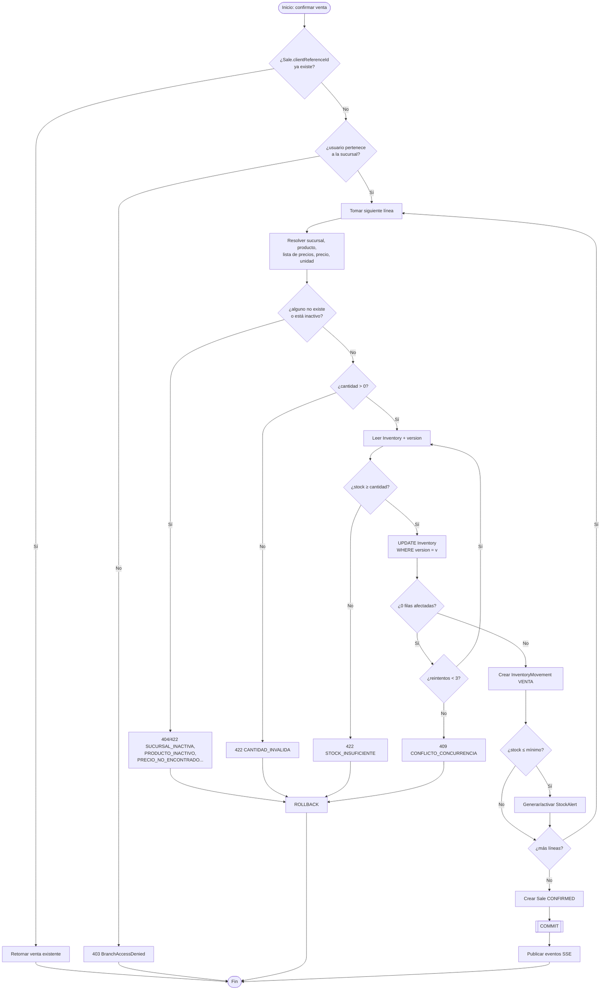
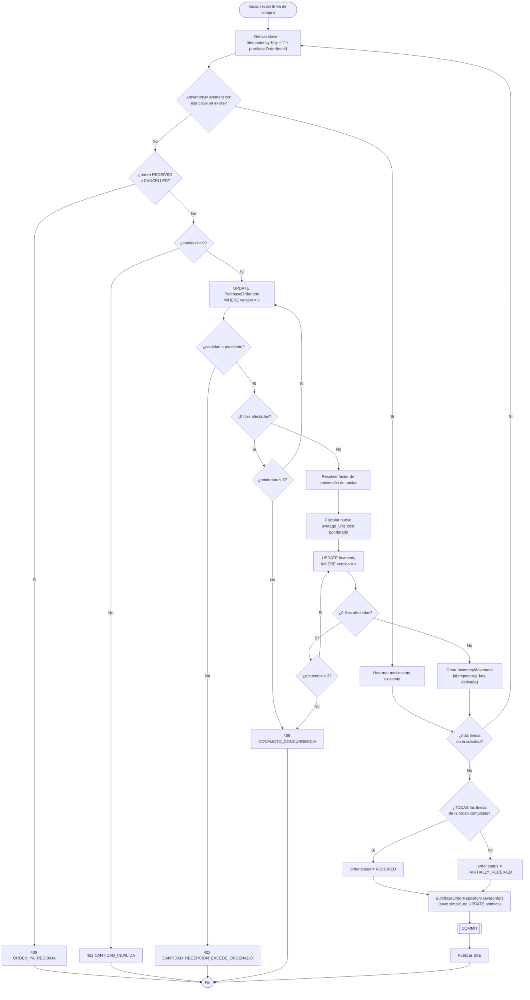
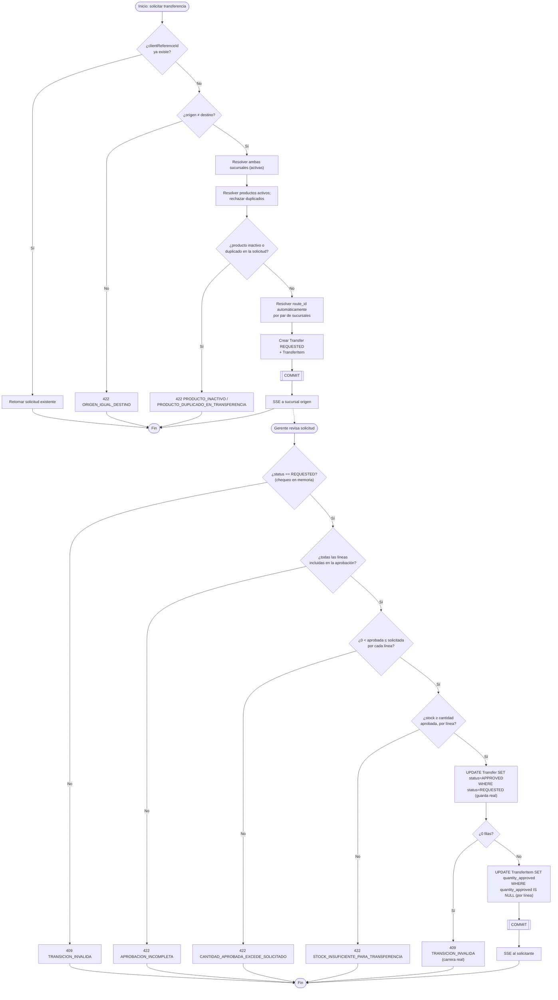
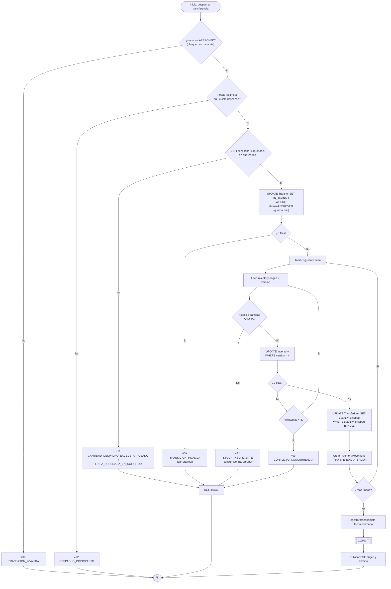
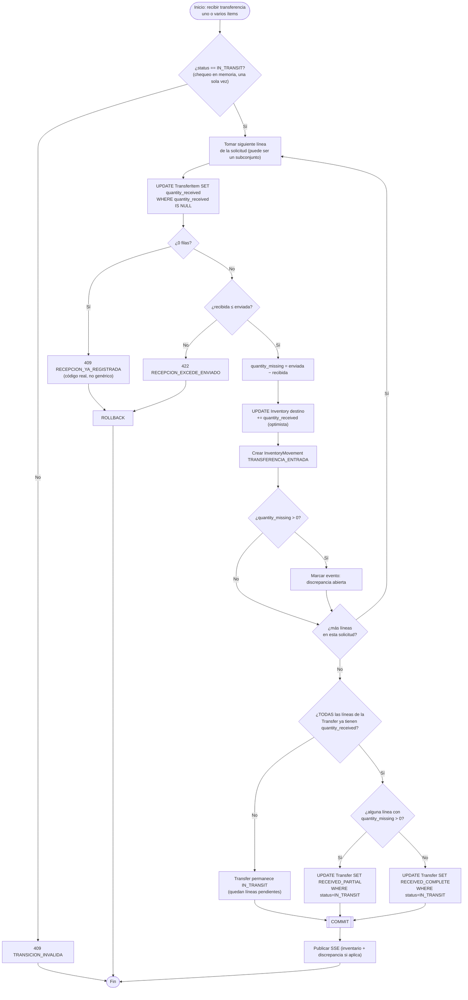
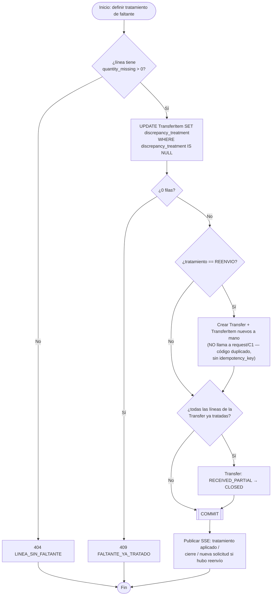
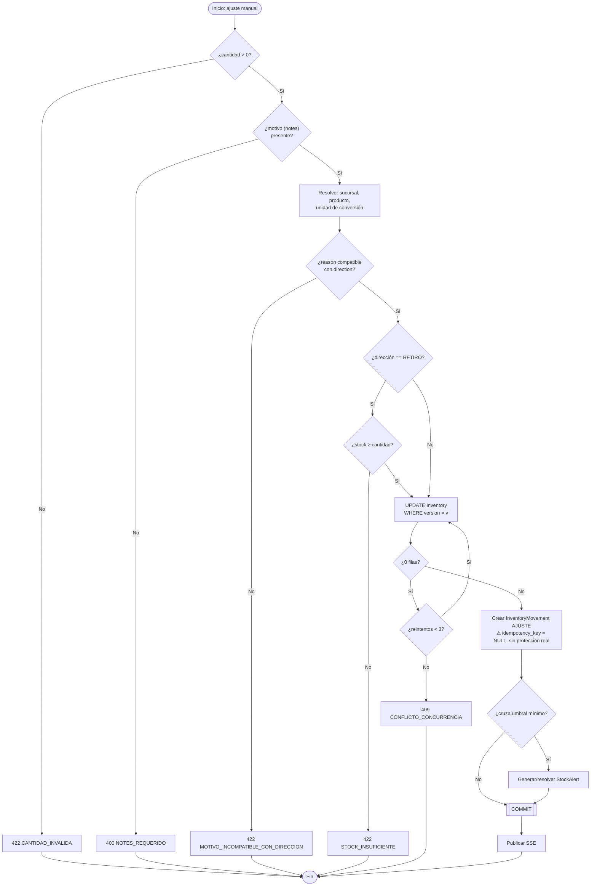
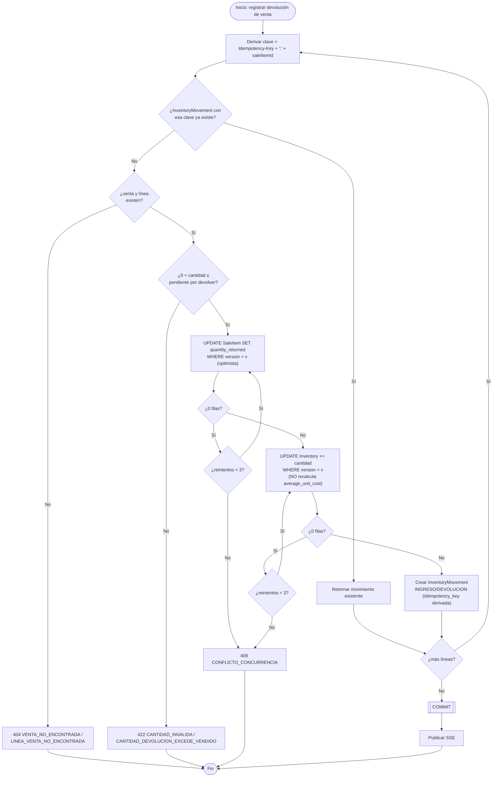

# Flujos Críticos

**Sistema de Inventario Multi-Sucursal**

**Base de este documento:** `docs/DOMAIN_MODEL.md`, `docs/BUSINESS_RULES.md`, `docs/ARCHITECTURE.md` (secciones 6 y 7), `docs/USE_CASES.md`.

**Fecha original:** 2026-08-26 (diseño en pseudocódigo, previo a la implementación). **Auditado y corregido el 2026-08-29 contra el código real** (`SaleService`, `PurchaseReceiptService`, `TransferService`, `InventoryMovementService`, `SaleReturnService`). Este documento ya no describe una intención de diseño: describe el comportamiento verificado del código a la fecha de la auditoría — si el código cambia, debe volver a auditarse, no asumirse vigente. Los cambios de fondo respecto a la versión de diseño están marcados **†** en cada flujo.

---

## 1. Principios transversales (aplican a todos los flujos)

Se explican una sola vez aquí para no repetirlos en cada flujo; cada flujo solo referencia cuál aplica.

### 1.1 Dos categorías de idempotencia

No todas las operaciones críticas se protegen igual — depende de si la operación es una **transición de estado de un recurso ya existente** o la **creación de un nuevo registro**:

- **Categoría 1 — Transición de estado, de un solo uso (state-guard):** aprobar/rechazar una transferencia, despachar, confirmar recepción completa/parcial, cerrar tras tratamiento. Se protege con un `UPDATE ... WHERE status = <estado_esperado>` (comparación-y-escritura atómica a nivel de SQL). Si la fila ya cambió de estado, el `UPDATE` afecta cero filas y la aplicación responde `409` — no requiere una clave de idempotencia enviada por el cliente.
- **Categoría 2 — Creación o evento repetible (idempotency key):** registrar una venta, confirmar una recepción de compra, un ajuste manual de inventario, y una devolución de venta. Aquí el estado del recurso no distingue por sí solo la siguiente operación legítima de un reintento accidental — se requiere `idempotency_key` persistida con `UNIQUE`.
- **† Verificado 2026-08-29 — no todas las operaciones de categoría 2 tienen la protección realmente implementada.** Ver flujo G: el ajuste manual de inventario está clasificado como categoría 2 en este documento, pero el código **no implementa ninguna clave de idempotencia** para él — es un gap real, no una decisión de diseño. Ver también la nota sobre `PurchaseOrderService.create` al final de la sección 4.

### 1.2 Concurrencia: bloqueo optimista sobre agregados numéricos

Toda fila que se **lee, se modifica en función de su valor actual, y se vuelve a escribir** usa bloqueo optimista mediante una columna `version`. Confirmado en código sobre: `Inventory.quantity_on_hand`/`average_unit_cost`, `PurchaseOrderItem.quantity_received`, y (hallazgo nuevo, no anticipado por el diseño original) `SaleItem.quantity_returned` (flujo H). El patrón es siempre:

```
leer fila y su version actual (v)
calcular nuevo valor
UPDATE tabla SET valor = nuevo_valor, version = v + 1 WHERE id = ? AND version = v
SI filas_afectadas = 0:
    reintentar desde "leer fila" (máximo 3 intentos — MAX_RETRIES=3, constante verificada en cada Service)
    SI se agotan los reintentos: error 409 CONFLICTO_CONCURRENCIA
```

### 1.3 † Guarda de escritura única por línea (patrón real, no contemplado en el diseño original)

Descubierto al auditar `TransferService`: varias columnas de `TransferItem` (`quantity_approved`, `quantity_shipped`, `quantity_received`, `discrepancy_treatment`) se fijan **exactamente una vez**, protegidas con `UPDATE ... WHERE columna IS NULL` — un tercer patrón de concurrencia, distinto tanto del bloqueo optimista (1.2, sobre agregados que cambian varias veces) como de la guarda de estado de categoría 1 (1.1, sobre el documento completo). Es una guarda de categoría 1 aplicada **a nivel de línea en vez de a nivel de documento**, y es precisamente lo que permite que un documento con varias líneas (una transferencia con varios productos) se procese línea por línea, en solicitudes separadas y potencialmente concurrentes, sin que una línea bloquee o duplique el efecto de otra. Este patrón aparece en los flujos C2, D, E+F1 y F2.

### 1.4 Límite transaccional

Cada flujo se ejecuta en **una única transacción de base de datos**. Ningún flujo hace `commit` parcial entre pasos. Cualquier evento posterior (SSE, notificación) ocurre **después** del `commit`, nunca dentro de la transacción (`docs/ARCHITECTURE.md`, sección 7).

---

## 2. Flujos

### A. Registro de venta

| Campo | Detalle |
|---|---|
| **Servicio real** | `SaleService.confirmSale` |
| **Actor** | Operador de inventario (o Gerente/Admin) de la sucursal donde se vende. |
| **Cambios de estado** | Ninguno intermedio — la venta se crea directamente en `CONFIRMED`. |
| **Cambios de stock** | `Inventory.quantity_on_hand -= cantidad`, por cada línea, en la sucursal del vendedor. |
| **InventoryMovement generado** | Uno por línea: `direction=RETIRO`, `reason=VENTA`, `sale_item_id` poblado. |
| **Locking/concurrencia** | Optimista sobre `Inventory.version` por cada producto afectado (MAX_RETRIES=3). |
| **Idempotencia** | Categoría 2 — `Sale.clientReferenceId`, `UNIQUE`; comprobada **antes** de cualquier otra validación, incluida la autorización por sucursal. |
| **† Errores reales** | `CANTIDAD_INVALIDA`, `STOCK_INSUFICIENTE`, `CONFLICTO_CONCURRENCIA`, `SUCURSAL_NO_ENCONTRADA`, `SUCURSAL_INACTIVA`, `PRODUCTO_NO_ENCONTRADO`, `PRODUCTO_INACTIVO`, `LISTA_PRECIOS_NO_ENCONTRADA`, `LISTA_PRECIOS_INACTIVA`, `PRECIO_NO_ENCONTRADO`, `UNIDAD_NO_SOPORTADA`, `IDEMPOTENCY_KEY_REQUERIDO`. **`DESCUENTO_FUERA_DE_RANGO` no existe** — el código no valida el rango del descuento en absoluto (gap real, no un error de este documento). La autorización por sucursal la resuelve `AuthorizationService` con `BranchAccessDeniedException` (403), no un código de negocio propio como `SUCURSAL_NO_AUTORIZADA`. |
| **Eventos posteriores al commit** | SSE de inventario actualizado; SSE de alerta de stock mínimo si se cruzó el umbral. |

**Diagrama de actividad:**



Versión interactiva con el mismo contenido (tema visual compartido con los demás diagramas del proyecto): [artifact de diagramas de flujo](https://claude.ai/code/artifact/ce3f0f4c-0fb7-4506-9a0a-422ec9f9cd36).

---

### B. Recepción de compra

| Campo | Detalle |
|---|---|
| **Servicio real** | `PurchaseReceiptService.receive` |
| **Actor** | Operador de inventario de la sucursal receptora. |
| **Cambios de estado** | `PurchaseOrder.status → PARTIALLY_RECEIVED` o `→ RECEIVED`, evaluado tras procesar todas las líneas de la solicitud. |
| **Cambios de stock** | `Inventory.quantity_on_hand += cantidad recibida` (convertida a unidad base); `average_unit_cost` recalculado (costo promedio ponderado). |
| **InventoryMovement generado** | `direction=INGRESO`, `reason=COMPRA`, `purchase_order_item_id` poblado. |
| **Locking/concurrencia** | Optimista sobre `Inventory.version` **y** sobre `PurchaseOrderItem.version` (MAX_RETRIES=3 en ambos). |
| **† Idempotencia — clave derivada, no la clave bruta del cliente** | La clave real que protege cada `InventoryMovement` es `idempotency_key_del_cliente + ":" + purchaseOrderItemId` — no el `Idempotency-Key` del header tal cual. Esto permite reintentar la solicitud completa (que puede traer varias líneas) sin reaplicar ninguna línea ya procesada, aunque otras líneas de la misma solicitud sí sean nuevas. |
| **† Cierre de la orden — no es un `UPDATE` atómico** | A diferencia de las transiciones de `Transfer` (categoría 1, sección 1.1), el cambio de `PurchaseOrder.status` es un `purchaseOrderRepository.save(order)` normal, no `UPDATE ... WHERE status = X`. No representa un riesgo real porque cada línea ya está protegida por su propio `version`, pero la mecánica es distinta a la de transferencias. |
| **Errores reales** | `CANTIDAD_INVALIDA`, `CANTIDAD_RECEPCION_EXCEDE_ORDENADO`, `ORDEN_YA_RECIBIDA`, `CONFLICTO_CONCURRENCIA`, `ORDEN_COMPRA_NO_ENCONTRADA`, `LINEA_ORDEN_NO_ENCONTRADA`, `UNIDAD_NO_SOPORTADA`, `IDEMPOTENCY_KEY_REQUERIDO`. |
| **Orden verificado** | La comprobación de idempotencia (por línea) ocurre **antes** que la comprobación de estado de la orden — confirmado explícitamente en el código, comentario de clase de `PurchaseReceiptService`. |

**Diagrama de actividad:**



---

### C1+C2. Solicitud y aprobación de transferencia

#### C1 — Solicitud (`TransferService.request`)

| Campo | Detalle |
|---|---|
| **Cambios de estado** | Se crea `Transfer` en `REQUESTED`. |
| **Idempotencia** | Categoría 2 — `Transfer.clientReferenceId`, `UNIQUE`, comprobada primero. |
| **† Validaciones no documentadas originalmente** | Ambas sucursales deben existir y estar activas; cada producto debe existir y estar activo; **`PRODUCTO_DUPLICADO_EN_TRANSFERENCIA`** — no se puede solicitar el mismo producto dos veces en la misma solicitud (regla de negocio completa, ausente del diseño original). |
| **Detalle no documentado originalmente** | `Transfer.route_id` se resuelve automáticamente por par de sucursales (coincide con `ARCHITECTURE.md`, pero el diseño de flujos nunca lo mencionó). |
| **Errores reales** | `ORIGEN_IGUAL_DESTINO`, `CANTIDAD_INVALIDA`, `SUCURSAL_NO_ENCONTRADA`, `SUCURSAL_INACTIVA`, `PRODUCTO_NO_ENCONTRADO`, `PRODUCTO_INACTIVO`, `PRODUCTO_DUPLICADO_EN_TRANSFERENCIA`. |

#### C2 — Aprobación / rechazo (`TransferService.approve` / `reject`)

| Campo | Detalle |
|---|---|
| **Cambios de estado** | `REQUESTED → APPROVED` (con `quantity_approved` por línea) o `REQUESTED → REJECTED`. |
| **† Orden real, distinto del pseudocódigo original** | El diseño original ponía la guarda atómica `UPDATE ... WHERE status='REQUESTED'` como primer paso. El código real hace: (1) chequeo de estado **en memoria** (`requireStatus`, no atómico) → (2) validaciones de negocio 422 (`APROBACION_INCOMPLETA`, `CANTIDAD_APROBADA_EXCEDE_SOLICITADO`, stock disponible) → (3) **recién ahí** el `UPDATE Transfer ... WHERE status='REQUESTED'` atómico real → (4) un **segundo nivel de guarda atómica por línea**, `UPDATE TransferItem SET quantity_approved ... WHERE quantity_approved IS NULL` (sección 1.3). |
| **† Reglas de negocio no documentadas originalmente** | `APROBACION_INCOMPLETA` — hay que aprobar todas las líneas de la solicitud juntas, no una por una; `CANTIDAD_APROBADA_EXCEDE_SOLICITADO`. |
| **Errores reales** | `TRANSICION_INVALIDA`, `STOCK_INSUFICIENTE_PARA_TRANSFERENCIA`, `CANTIDAD_INVALIDA`, `CANTIDAD_APROBADA_EXCEDE_SOLICITADO`, `APROBACION_INCOMPLETA`. |

**Nota de diseño (vigente):** aprobar no reserva/bloquea stock físicamente — el stock se descuenta recién al despachar (flujo D), donde se revalida. La consecuencia aceptada (una aprobación puede quedar sin poder despacharse si el stock se consume después) sigue siendo la misma que en el diseño original — ver escenario 3.2.

**Diagrama de actividad:**



---

### D. Preparación y despacho de transferencia

| Campo | Detalle |
|---|---|
| **Servicio real** | `TransferService.dispatch` |
| **Actor** | Operador de la sucursal origen. |
| **Cambios de estado** | `APPROVED → IN_TRANSIT`. |
| **Cambios de stock** | `Inventory(origen).quantity_on_hand -= quantity_shipped`, por línea. |
| **InventoryMovement generado** | `direction=RETIRO`, `reason=TRANSFERENCIA_SALIDA`, `transfer_item_id` poblado. |
| **† Orden real, mismo patrón que C2** | Chequeo de estado en memoria (`requireStatus`, `APPROVED`) → validaciones 422 (`DESPACHO_INCOMPLETO`, `CANTIDAD_DESPACHO_EXCEDE_APROBADO`, `LINEA_DUPLICADA_EN_SOLICITUD`) → **recién ahí** `UPDATE Transfer ... WHERE status='APPROVED'` atómico real → bloqueo optimista sobre `Inventory.version` por línea (compite con ventas, escenario 3.2) → guarda atómica por línea `UPDATE TransferItem SET quantity_shipped ... WHERE quantity_shipped IS NULL`. |
| **† Regla no documentada originalmente** | `DESPACHO_INCOMPLETO` — todas las líneas aprobadas deben despacharse juntas en una sola solicitud. |
| **Errores reales** | `TRANSICION_INVALIDA`, `CANTIDAD_DESPACHO_EXCEDE_APROBADO`, `STOCK_INSUFICIENTE`, `CONFLICTO_CONCURRENCIA`, `CANTIDAD_INVALIDA`, `DESPACHO_INCOMPLETO`, `LINEA_DUPLICADA_EN_SOLICITUD`. |
| **Idempotencia** | Categoría 1 — sin `idempotency_key`; un reintento ve `status ≠ APPROVED` (o el guard por línea ya poblado) y recibe 409. |

**Diagrama de actividad:**



---

### E+F1. Recepción de transferencia — **unificado en un solo método real**

**† Corrección estructural más importante de esta auditoría.** El diseño original documentaba "Recepción completa" (E) y "Recepción parcial" (F1) como dos flujos separados con dos endpoints distintos. **El código real tiene un único método, `TransferService.receive`**, que acepta una o varias líneas por solicitud (incluso un subconjunto de las líneas de la transferencia) y **difiere la transición de estado de la `Transfer` hasta que todas sus líneas tienen `quantity_received` registrado**. Solo entonces decide entre `RECEIVED_COMPLETE` (ninguna línea con faltante) y `RECEIVED_PARTIAL` (alguna línea con faltante).

| Campo | Detalle |
|---|---|
| **Servicio real** | `TransferService.receive` |
| **Actor** | Operador de la sucursal destino. |
| **Precondición** | `Transfer.status = IN_TRANSIT`, comprobado en memoria **una sola vez** por solicitud (no por línea). |
| **Por cada línea de la solicitud** | Guarda atómica por línea `UPDATE TransferItem SET quantity_received ... WHERE quantity_received IS NULL` (409 `RECEPCION_YA_REGISTRADA` si ya estaba fijada); valida `quantity_received ≤ quantity_shipped` (422 `RECEPCION_EXCEDE_ENVIADO`); calcula `quantity_missing`; incrementa `Inventory(destino)` (bloqueo optimista); crea `InventoryMovement` (`INGRESO`/`TRANSFERENCIA_ENTRADA`); si `quantity_missing > 0`, marca el evento de discrepancia abierta. |
| **Al final de la solicitud** | Si **todas** las líneas de la `Transfer` (no solo las de esta solicitud) ya tienen `quantity_received`: `UPDATE Transfer SET status = RECEIVED_PARTIAL|RECEIVED_COMPLETE WHERE status = IN_TRANSIT`, eligiendo según si hubo algún faltante. Si quedan líneas sin recibir, la `Transfer` permanece `IN_TRANSIT`. |
| **† Código de error real no anticipado** | `RECEPCION_YA_REGISTRADA` (409) — el diseño original atribuía este caso genéricamente a `TRANSICION_INVALIDA`. |
| **Consecuencia sobre la sección 4 del diseño original** | La corrección "pendiente de aprobación" que proponía relajar la guarda a `WHERE status IN (IN_TRANSIT, RECEIVED_PARTIAL)` (para permitir recibir una segunda línea después de que la primera ya dejó la transferencia en `RECEIVED_PARTIAL`) **quedó obsoleta**: el problema que motivaba esa propuesta no puede ocurrir con este diseño, porque el estado de `Transfer` nunca se mueve hasta que la última línea pendiente se recibe. Se resolvió con un diseño distinto al propuesto, no implementando la propuesta original. |
| **Evento de discrepancia** | No reutiliza `StockAlert` — evento propio (`transfer.discrepancy-opened`), consistente con la nota de diseño original. |

**Diagrama de actividad** (reemplaza a los dos diagramas separados del diseño original):



---

### F2. Definir tratamiento de faltante y cerrar

| Campo | Detalle |
|---|---|
| **Servicio real** | `TransferService.applyDiscrepancyTreatment` |
| **Actor** | Gerente de sucursal. |
| **Cambios de estado** | `TransferItem.discrepancy_treatment` fijado (guarda atómica `WHERE discrepancy_treatment IS NULL`); si todas las líneas de la `Transfer` ya están tratadas, `RECEIVED_PARTIAL → CLOSED`. |
| **† El reenvío NO reutiliza el flujo C1** | El diseño original afirmaba que el tratamiento `REENVIO` "reutiliza el flujo C1 como sub-operación de la misma transacción". **Esto es falso.** El código construye la `Transfer`/`TransferItem` de reenvío directamente (`new Transfer(...)`, `new TransferItem(...)`), duplicando la lógica de creación de C1 en vez de invocar `TransferService.request(...)` — y por lo tanto **sin `idempotency_key`** (se pasa `clientReferenceId = null`) y sin las validaciones de C1 (que no son necesarias aquí porque los datos ya vienen de una transferencia válida, pero confirma que es código duplicado, no reutilizado). |
| **† `TRATAMIENTO_INVALIDO` no existe** | Un valor de tratamiento fuera de `{REENVIO, AJUSTE, RECLAMACION}` falla en la deserialización JSON (400 genérico), no como un 422 de negocio con ese código. |
| **† Código real para "línea sin faltante"** | `LINEA_SIN_FALTANTE` (404) — el diseño original solo decía "404 (línea sin faltante)" sin nombrar el código. |
| **Errores reales** | `LINEA_SIN_FALTANTE`, `FALTANTE_YA_TRATADO`. |

**Diagrama de actividad:**



---

### G. Ajuste manual de inventario

| Campo | Detalle |
|---|---|
| **Servicio real** | `InventoryMovementService.createAdjustment` |
| **Actor** | Operador de inventario de la sucursal afectada. |
| **Cambios de stock** | `+ cantidad` (`AJUSTE_INGRESO`) o `- cantidad` (`AJUSTE_RETIRO`). |
| **Locking/concurrencia** | Optimista sobre `Inventory.version`, MAX_RETRIES=3 — igual que los demás flujos. |
| **⚠ Idempotencia — NO implementada, a diferencia de lo que afirma el diseño original** | El diseño original clasifica este flujo como categoría 2 y da por hecha su protección. **Verificado que no lo está**: `InventoryAdjustmentRequest` no tiene campo de clave de idempotencia; el controller no exige el header `Idempotency-Key`; el `InventoryMovement` se crea siempre con `idempotency_key = NULL`. **Un doble clic o un reintento HTTP duplica el efecto de un ajuste manual hoy.** Este es el único de los flujos "protegidos por categoría 2" que en realidad no tiene ninguna protección — riesgo real, no un supuesto de diseño. Queda como pendiente de corrección en el backend (fuera del alcance de esta auditoría de documentación). |
| **† Orden real de validación** | El diseño original validaba `notes` (motivo) antes que `cantidad > 0`. El código hace lo contrario: `cantidad > 0` primero, `notes` después. |
| **† Regla no documentada originalmente** | `MOTIVO_INCOMPATIBLE_CON_DIRECCION` — el `reason` opcional debe ser compatible con la `direction` (`DEVOLUCION`/`AJUSTE_INGRESO` solo válidos para `INGRESO`; `MERMA`/`AJUSTE_RETIRO` solo para `RETIRO`). |
| **Errores reales** | `CANTIDAD_INVALIDA`, `NOTES_REQUERIDO`, `STOCK_INSUFICIENTE`, `CONFLICTO_CONCURRENCIA`, `MOTIVO_INCOMPATIBLE_CON_DIRECCION`, `SUCURSAL_NO_ENCONTRADA`, `SUCURSAL_INACTIVA`, `PRODUCTO_NO_ENCONTRADO`, `PRODUCTO_INACTIVO`, `UNIDAD_NO_SOPORTADA`. |

**Diagrama de actividad:**



---

### H. Devolución de venta — **flujo nuevo, ausente del diseño original**

`SaleReturnService.createReturn`, `POST /sales/{id}/returns` (BR-052). No existía ninguna mención de este flujo en la versión de diseño de este documento.

| Campo | Detalle |
|---|---|
| **Actor** | Operador de inventario (o Gerente/Admin) de la sucursal de la venta original. |
| **Cambios de estado** | Ninguno sobre `Sale` — el comprobante original **nunca cambia de estado**; la devolución es un registro independiente. |
| **Cambios de stock** | `Inventory.quantity_on_hand += cantidad devuelta`, al **costo promedio ya vigente** (no se recalcula `average_unit_cost`, a diferencia de una compra). |
| **InventoryMovement generado** | `direction=INGRESO`, `reason=DEVOLUCION`, `sale_item_id` poblado. |
| **Locking/concurrencia** | Doble bloqueo optimista: sobre `SaleItem.version` (nuevo, no documentado en ningún flujo anterior) y sobre `Inventory.version`. MAX_RETRIES=3. |
| **Idempotencia** | Categoría 2 — clave derivada `idempotency_key_del_cliente + ":" + saleItemId` sobre `InventoryMovement.idempotency_key`, mismo patrón que el flujo B; comprobada antes que la validación de cantidad. |
| **Tope de negocio** | `cantidad ≤ pendiente_por_devolver` (`SaleItem.pending()` = cantidad vendida − ya devuelta). |
| **Errores reales** | `IDEMPOTENCY_KEY_REQUERIDO`, `VENTA_NO_ENCONTRADA`, `LINEA_VENTA_NO_ENCONTRADA`, `CANTIDAD_INVALIDA`, `CANTIDAD_DEVOLUCION_EXCEDE_VENDIDO`, `CONFLICTO_CONCURRENCIA`. |

**Diagrama de actividad:**



---

## 3. Análisis de escenarios críticos

Los cinco escenarios de la versión original (3.1 a 3.5) siguen siendo válidos en su razonamiento de concurrencia — el mecanismo de bloqueo optimista y las guardas de estado que describen se confirmaron en el código. Dos precisiones tras la auditoría 2026-08-29:

- **Escenario 3.3 (doble confirmación por reintento HTTP):** para la recepción de transferencias (E+F1 unificado), el código real devuelve **409 `RECEPCION_YA_REGISTRADA`** ante un reintento sobre una línea ya recibida — no el `TRANSICION_INVALIDA` genérico que suponía el documento original. Además, esta protección es por **línea**, no por transferencia completa: dos líneas distintas de la misma transferencia pueden recibirse en solicitudes separadas sin interferirse (ver sección 1.3).
- **Escenario 3.3, ajuste manual (flujo G):** **la garantía descrita ("el efecto de negocio ocurre exactamente una vez") NO se cumple para este flujo** — ver la advertencia de la sección G. Se mantiene aquí la referencia explícita para que quede trazable: de las operaciones que el escenario 3.3 afirma proteger, el ajuste manual es la excepción real confirmada.
- **Escenario 3.5 (recepción parcial y cierre posterior):** el razonamiento sigue siendo válido para el flujo F2 (tratamiento de faltantes por línea, independiente en el tiempo), pero la premisa sobre F1 (que motivaba la corrección de guarda `WHERE status IN (...)`) ya no aplica tal cual — ver la explicación completa en la sección "E+F1" arriba. El fenómeno de fondo (dos líneas atendidas en momentos distintos sin interferirse) sigue siendo real y sigue estando cubierto, solo que por el diseño unificado de `receive(...)`, no por la guarda de estado relajada que este documento proponía originalmente.

---

## 4. Ajustes al modelo de dominio — estado real verificado 2026-08-29

La versión original de esta sección listaba 4 ítems como "pendientes de aprobación". Verificado su estado real en el código:

1. **`PurchaseOrderItem.version`** — ✅ **implementado**. Confirmado en `PurchaseOrderItemRepository` y usado en el flujo B; el propio comentario de la clase `PurchaseOrderItem` señala que resuelve esta necesidad.
2. **`Sale.client_reference_id`** — ✅ **implementado**, `UNIQUE`, usado en el flujo A.
3. **`InventoryMovement.idempotency_key`** — ✅ **implementado**, pero **no para el caso que este documento anticipaba**: se usa en el flujo B (recepción de compra, clave derivada por línea) y en el flujo H (devolución de venta, mismo patrón) — **no se usa en el flujo G (ajuste manual)**, que era el caso concreto que esta sección proponía cubrir. Ver la advertencia de la sección G: sigue siendo un gap real.
4. **Guarda de estado del flujo F1, `WHERE status IN (IN_TRANSIT, RECEIVED_PARTIAL)`** — ❌ **no se implementó tal cual, y ya no hace falta**. El código resolvió el mismo problema de fondo con un diseño distinto: `TransferService.receive` difiere la transición de estado de la `Transfer` hasta que todas sus líneas están atendidas, en vez de relajar la guarda de un estado ya alcanzado. Ver la sección "E+F1" arriba para el detalle completo — este ítem se considera cerrado, no pendiente.

**Gaps reales adicionales encontrados en esta auditoría (no en la lista original):**

5. **Ajuste manual de inventario (flujo G) sin idempotencia real** — ver advertencia en la sección G. Es la corrección de código más concreta y accionable que dejó esta auditoría.
6. **`PurchaseOrderService.create` exige el header `Idempotency-Key` (400 si falta) pero no lo usa para deduplicar** — un reintento con la misma clave crea una segunda orden de compra. El propio código lo admite como limitación conocida en un comentario, pero `CRITICAL_FLOWS.md` nunca documentó este flujo de creación de orden como crítico — se deja registrado aquí porque es del mismo tipo de riesgo (categoría 2) que los demás flujos de este documento.

---

**Documentos relacionados:** `docs/DOMAIN_MODEL.md`, `docs/BUSINESS_RULES.md`, `docs/ARCHITECTURE.md`, [diagramas de actividad (artifact)](https://claude.ai/code/artifact/ce3f0f4c-0fb7-4506-9a0a-422ec9f9cd36).
