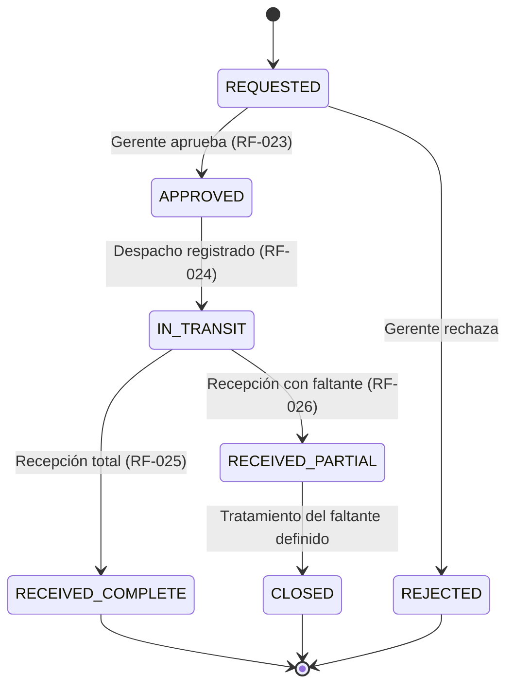
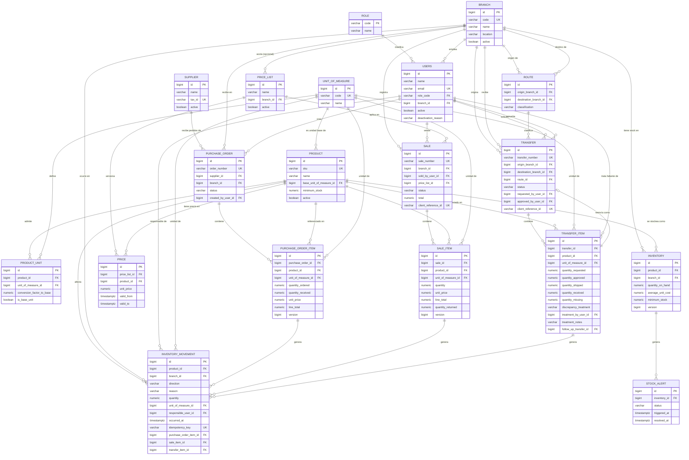

# Modelo de Dominio y Modelo de Datos

**Sistema de Inventario Multi-Sucursal**

**Base de este documento:** `docs/PROJECT_BRIEF.md`, `docs/REQUIREMENTS_TRACEABILITY.md`, `docs/USE_CASES.md`, `docs/ARCHITECTURE.md`, `docs/adr/ADR-008-trazabilidad-inventory-movement.md`.

**Fecha:** 2026-08-26.

**Alcance de este documento:** modelo conceptual/lógico de entidades y su diagrama entidad-relación. **No** se generan entidades JPA, no se generan scripts de migración (Flyway/Liquibase) ni DDL ejecutable. Los fragmentos tipo `CHECK (...)` que aparecen abajo son notación de diseño para comunicar una restricción, no una migración lista para ejecutar.

**Convención de etiquetas** (igual que en documentos previos): **[Origen]** exigido por el documento fuente, **[Decisión]** elección de diseño del proyecto, **[Supuesto]** interpretación pendiente de confirmación.

---

## 1. Principios de modelado transversales

Estos principios aplican a todas las entidades salvo que se indique lo contrario; se explican una vez aquí para no repetirlos en cada ficha de entidad.

- **Identificador:** todas las entidades usan una clave primaria numérica autoincremental (`BIGINT IDENTITY`), no UUID. **[Decisión, en lista de aprobación final]** — justificación: no hay requisito de ocultar secuencialidad frente a un cliente externo, el volumen de esta prueba no exige claves distribuibles sin coordinación, y una clave numérica es más liviana para índices y claves foráneas en PostgreSQL. Donde conviene un identificador legible de negocio (SKU de producto, número de orden de compra), se agrega como columna `UNIQUE` adicional, no reemplaza la clave primaria.
- **Timestamps y responsable (auditabilidad, RF-009):** toda tabla que representa un hecho de negocio (movimiento, venta, orden de compra, transferencia, precio) tiene `created_at` (momento de inserción, inmutable) y, cuando corresponde, `occurred_at`/`*_at` específico del evento de negocio (p. ej. `dispatched_at`, `received_at`) para distinguir cuándo ocurrió el hecho de cuándo se registró en el sistema. Toda acción que un usuario ejecuta guarda el `*_by_user_id` correspondiente (`responsible_user_id`, `created_by_user_id`, `approved_by_user_id`, etc.) — nunca solo un timestamp sin responsable.
- **Inmutabilidad y no-eliminación de historial:** ninguna tabla que registre un hecho ya ocurrido (`InventoryMovement`, `PurchaseOrderItem` una vez recibido, `SaleItem`, `Price` una vez vigente, `TransferItem` una vez despachado/recibido) permite `UPDATE` de sus campos históricos ni `DELETE`. Una corrección se modela como un nuevo registro (movimiento compensatorio, nueva versión de precio), nunca como edición retroactiva.
- **Baja lógica, no física:** entidades de referencia que participan en historial (`Branch`, `Product`, `User`, `Supplier`) usan un indicador `active`/`is_active` para desactivarse; su eliminación física está bloqueada por las propias claves foráneas de las tablas de historial (`ON DELETE RESTRICT`), nunca por convención únicamente de aplicación.
- **Nombres:** tablas en `snake_case`, plural (p. ej. `inventory_movements`), consistente con la convención estándar de PostgreSQL/Hibernate; no se define aquí el detalle exacto porque eso es ya diseño de migración.
- **Implementación de `created_at`/`updated_at`/`created_by`/`updated_by`:** las entidades de referencia/documento (no los ledgers append-only) que necesiten estas columnas genéricas extienden `common.audit.Auditable` (`backend/src/main/java/com/inventario/multisucursal/common/audit/`), que las completa automáticamente vía Spring Data JPA Auditing, con el auditor resuelto por `auth.JpaAuditingConfig` a partir del usuario autenticado — ver `docs/ARCHITECTURE.md`, sección 8.

## 2. Catálogo de entidades

### 2.1 Branch (Sucursal)

- **Propósito:** unidad operativa autónoma de la organización (RF-001).
- **Atributos esenciales:** nombre, código corto (para referencias legibles), dirección/ubicación, estado activo/inactivo.
- **Identificador:** `id` (BIGINT).
- **Relaciones y cardinalidad:** 1 Branch → N `User` (empleados asignados); 1 Branch → N `Inventory`; 1 Branch → N `InventoryMovement`; 1 Branch → N `Sale`; 1 Branch → N `PurchaseOrder` (como receptora); 1 Branch → N `Transfer` (como origen) y 1 Branch → N `Transfer` (como destino, relación separada).
- **Restricciones de unicidad:** `code` único.
- **Estados válidos:** `active` / `inactive` (booleano; no una máquina de estados compleja).
- **Dueño de la relación:** `Branch` es el lado "uno" en todas sus relaciones; las tablas dependientes (`User`, `Inventory`, etc.) son dueñas de la clave foránea.
- **Datos históricos:** ninguno propio; es una entidad de referencia. No se elimina físicamente si tiene inventario, movimientos o transferencias asociadas (`ON DELETE RESTRICT` desde esas tablas).

### 2.2 Role (Rol)

- **Propósito:** catálogo cerrado de los tres roles RBAC ya aprobados (TD-008): `ADMIN`, `MANAGER`, `OPERATOR`.
- **Atributos esenciales:** código (clave de negocio), nombre descriptivo.
- **Identificador:** `code` (texto corto, p. ej. `ADMIN`) como clave primaria natural — no se necesita un `id` numérico adicional para una tabla de 3 filas fijas.
- **Relaciones y cardinalidad:** 1 Role → N `User`.
- **Restricciones de unicidad:** `code` es la propia clave primaria.
- **Estados válidos:** no aplica (catálogo fijo, sembrado una sola vez).
- **Dueño de la relación:** `User` es dueño de la clave foránea `role_code`.
- **Datos históricos:** ninguno. No se elimina ni se modifica en operación normal; cualquier cambio de catálogo de roles es un evento de migración, no de uso diario.
- **Por qué tabla y no un `ENUM` nativo de PostgreSQL [Decisión]:** una tabla de referencia permite escribir `CHECK`/`FOREIGN KEY` legibles y, si en el futuro se agregan metadatos por rol (p. ej. descripción visible en UI), no exige alterar un tipo `ENUM` con los bloqueos que eso implica en PostgreSQL.

### 2.3 User (Usuario)

- **Propósito:** persona autenticada que opera el sistema (RF-037 a RF-039).
- **Atributos esenciales:** nombre, correo electrónico, hash de contraseña, `role_code` (FK), `branch_id` (FK, nullable), estado activo/inactivo.
- **Identificador:** `id` (BIGINT).
- **Relaciones y cardinalidad:** N `User` → 1 `Branch` (0..1 — nulo solo para `ADMIN`); N `User` → 1 `Role`. Es referenciado como responsable desde `InventoryMovement`, `Sale`, `PurchaseOrder`, `Transfer` (varias veces: solicitante, aprobador).
- **Restricciones de unicidad:** `email` único.
- **Estados válidos:** `active` / `inactive` (desactivación, nunca borrado si tiene historial).
- **Restricción a nivel de base de datos (aprovechando `CHECK`):** `CHECK ((role_code = 'ADMIN') OR (branch_id IS NOT NULL))` — un `MANAGER` u `OPERATOR` siempre pertenece a una sucursal; solo `ADMIN` puede tener alcance global sin sucursal fija, reflejando RF-037 a RF-039.
- **Dueño de la relación:** `User` es dueño de sus propias FKs (`branch_id`, `role_code`); es referenciado, nunca dueño, desde las tablas de historial que lo citan como responsable.
- **Datos históricos:** su `email`/`nombre` pueden actualizarse; nunca se elimina físicamente si aparece como responsable en algún movimiento, venta, compra o transferencia (`ON DELETE RESTRICT` desde esas tablas) — se desactiva.

### 2.4 UnitOfMeasure (Unidad de medida)

- **Propósito:** catálogo de unidades (unidad, caja, kilogramo, etc.) para soportar RF-011.
- **Atributos esenciales:** código (p. ej. `UN`, `CJ`, `KG`), nombre.
- **Identificador:** `id` (BIGINT).
- **Relaciones y cardinalidad:** 1 UnitOfMeasure → N `ProductUnit`; también referenciada puntualmente desde `InventoryMovement`, `PurchaseOrderItem`, `SaleItem`, `TransferItem` (la unidad en la que se registró esa línea específica).
- **Restricciones de unicidad:** `code` único.
- **Estados válidos:** no aplica.
- **Dueño de la relación:** las tablas que la referencian son dueñas de la FK; `UnitOfMeasure` es puro catálogo.
- **Datos históricos:** ninguno.

### 2.5 Product (Producto)

- **Propósito:** artículo gestionable en inventario (RF-005).
- **Atributos esenciales:** SKU, nombre, descripción, `base_unit_of_measure_id` (FK — la unidad en la que se agrega el stock, ver decisión 3), estado activo/inactivo.
- **Identificador:** `id` (BIGINT).
- **Relaciones y cardinalidad:** 1 Product → N `Inventory` (una fila de stock por sucursal, ver decisión 1); 1 Product → N `ProductUnit`; 1 Product → N `InventoryMovement`, `PurchaseOrderItem`, `SaleItem`, `TransferItem`, `Price`.
- **Restricciones de unicidad:** `sku` único.
- **Estados válidos:** `active` / `inactive`.
- **Dueño de la relación:** `Product` es el lado "uno"; las tablas dependientes son dueñas de la FK.
- **Datos históricos:** su nombre/descripción pueden actualizarse; no se elimina físicamente si tiene cualquier movimiento, línea de compra/venta/transferencia o precio asociado (`ON DELETE RESTRICT`).

### 2.6 ProductUnit (Unidad de producto)

- **Propósito:** relación producto↔unidad de medida con su factor de conversión hacia la unidad base (RF-011).
- **Atributos esenciales:** `product_id` (FK), `unit_of_measure_id` (FK), `conversion_factor_to_base` (numérico, > 0), `is_base_unit` (booleano).
- **Identificador:** `id` (BIGINT).
- **Relaciones y cardinalidad:** N `ProductUnit` → 1 `Product`; N `ProductUnit` → 1 `UnitOfMeasure`.
- **Restricciones de unicidad:** `UNIQUE (product_id, unit_of_measure_id)`; además, índice único parcial `UNIQUE (product_id) WHERE is_base_unit = true` — garantiza en la base de datos que un producto tenga **exactamente una** unidad base, sin depender de que la aplicación lo recuerde validar.
- **Estados válidos:** no aplica.
- **Dueño de la relación:** `ProductUnit` es dueño de ambas FKs.
- **Datos históricos:** el factor de conversión no debería cambiar una vez usado en movimientos existentes; si cambia, se trata como una corrección administrativa explícita, no como parte del flujo operativo normal.

### 2.7 Inventory (Stock agregado por producto y sucursal)

- **Propósito:** cantidad actual disponible de un producto en una sucursal, junto con su costo promedio ponderado vigente (decisión 1 y 2, más abajo; BR-004, BR-016).
- **Atributos esenciales:** `product_id` (FK), `branch_id` (FK), `quantity_on_hand` (numérico, en unidad base), `average_unit_cost` (numérico, costo promedio ponderado vigente en la unidad base — **[Decisión, agregada por ajuste aprobado sobre `docs/BUSINESS_RULES.md` BR-004/BR-016]**), `minimum_stock` (numérico, en unidad base), `version` (entero, para bloqueo optimista), `updated_at`.
- **Identificador:** `id` (BIGINT), con clave de negocio compuesta única (ver abajo).
- **Relaciones y cardinalidad:** N `Inventory` → 1 `Product`; N `Inventory` → 1 `Branch`; 1 `Inventory` → N `StockAlert`.
- **Restricciones de unicidad:** `UNIQUE (product_id, branch_id)` — exactamente una fila de stock por combinación producto/sucursal.
- **Restricción de integridad:** `CHECK (quantity_on_hand >= 0)` (ver decisión 7); `CHECK (average_unit_cost >= 0)`.
- **Estados válidos:** no aplica (es un valor numérico, no una máquina de estados).
- **Dueño de la relación:** `Inventory` es dueño de sus FKs hacia `Product` y `Branch`; es el lado "uno" respecto de `StockAlert`.
- **Datos históricos:** **ninguno** — es, por diseño, el único dato mutable/sobrescribible del subdominio de inventario; su historial (de cantidad y de costo) vive en `InventoryMovement` y en las líneas de recepción de compra que originaron cada recálculo (ver ADR-008). `average_unit_cost` se sobrescribe en cada recepción de compra (BR-004); no es un valor versionado como `Price` porque no necesita conservarse por período — el costo histórico exacto de cada recepción ya queda inmutable en `PurchaseOrderItem.unit_price`.

### 2.8 InventoryMovement (Movimiento de inventario — ledger)

- **Propósito:** registro append-only de cada cambio de stock, con trazabilidad completa (RF-007, RF-008, RF-009, BR-001; ADR-008).
- **Atributos esenciales:** `product_id` (FK), `branch_id` (FK), `direction` (`ENUM`: `INGRESO` / `RETIRO`), `reason` (`ENUM`: `COMPRA`, `DEVOLUCION`, `AJUSTE_INGRESO`, `VENTA`, `MERMA`, `AJUSTE_RETIRO`, `TRANSFERENCIA_SALIDA`, `TRANSFERENCIA_ENTRADA`), `quantity` (numérico, siempre positivo, en `unit_of_measure_id`), `unit_of_measure_id` (FK), `responsible_user_id` (FK, NOT NULL), `occurred_at` (timestamp del hecho de negocio), `notes` (texto libre, motivo adicional), `created_at` (inmutable). FKs de origen opcionales y mutuamente excluyentes: `purchase_order_item_id`, `sale_item_id`, `transfer_item_id` (nulos salvo el que corresponda a la razón del movimiento).
- **Identificador:** `id` (BIGINT).
- **Relaciones y cardinalidad:** N `InventoryMovement` → 1 `Product`; N → 1 `Branch`; N → 1 `User` (responsable); N → 0..1 `PurchaseOrderItem` / `SaleItem` / `TransferItem` (según `reason`).
- **Restricciones de unicidad:** ninguna natural (varios movimientos pueden compartir producto/sucursal/fecha); `quantity > 0` como `CHECK`.
- **Estados válidos:** no aplica — es un hecho, no un objeto con ciclo de vida.
- **Dueño de la relación:** `InventoryMovement` es dueño de todas sus FKs; nunca al revés.
- **Datos históricos:** **la tabla completa es histórica e inmutable.** Ningún campo se actualiza después de insertado; no se permite `DELETE`. Se recomienda reforzar esto revocando los privilegios `UPDATE`/`DELETE` sobre esta tabla al rol de base de datos que usa la aplicación, para que la inmutabilidad no dependa solo de la disciplina del código (ver `docs/ARCHITECTURE.md`, sección 8, y el principio de este proyecto de no trasladar toda la integridad a la aplicación).

### 2.9 StockAlert (Alerta de stock mínimo) — **[Decisión, entidad no listada en el enunciado, agregada para soportar RF-010/RF-036]**

- **Propósito:** trazar la generación y resolución de alertas de stock mínimo (funcionalidad adicional elegida, UC-16).
- **Atributos esenciales:** `inventory_id` (FK), `status` (`ENUM`: `ACTIVE` / `RESOLVED`), `triggered_at`, `resolved_at` (nullable).
- **Identificador:** `id` (BIGINT).
- **Relaciones y cardinalidad:** N `StockAlert` → 1 `Inventory`.
- **Restricciones de unicidad:** índice único parcial `UNIQUE (inventory_id) WHERE status = 'ACTIVE'` — evita alertas activas duplicadas para el mismo producto/sucursal, dejando que PostgreSQL lo garantice en vez de una comprobación de aplicación propensa a condición de carrera.
- **Estados válidos:** `ACTIVE` → `RESOLVED` (una sola transición; una nueva caída de stock después de resolver genera una alerta nueva, no reabre la anterior).
- **Dueño de la relación:** `StockAlert` es dueño de la FK hacia `Inventory`.
- **Datos históricos:** las alertas resueltas no se eliminan — quedan como historial de reabastecimiento.

### 2.10 Supplier (Proveedor)

- **Propósito:** tercero al que se le compran productos (RF-012).
- **Atributos esenciales:** razón social, identificación fiscal (NIT/RUC/equivalente), datos de contacto, estado activo/inactivo.
- **Identificador:** `id` (BIGINT).
- **Relaciones y cardinalidad:** 1 Supplier → N `PurchaseOrder`.
- **Restricciones de unicidad:** identificación fiscal única.
- **Estados válidos:** `active` / `inactive`.
- **Dueño de la relación:** `PurchaseOrder` es dueño de la FK.
- **Datos históricos:** no se elimina físicamente si tiene alguna orden de compra asociada.

### 2.11 PurchaseOrder (Orden de compra)

- **Propósito:** ciclo de adquisición a un proveedor (RF-012, RF-013).
- **Atributos esenciales:** `supplier_id` (FK), `branch_id` (FK, sucursal receptora), `order_number` (código legible), `status` (`ENUM`: `CREATED`, `PARTIALLY_RECEIVED`, `RECEIVED`, `CANCELLED`), `payment_term` (texto/enum simple), `order_date`, `created_by_user_id` (FK), `created_at`.
- **Identificador:** `id` (BIGINT).
- **Relaciones y cardinalidad:** N `PurchaseOrder` → 1 `Supplier`; N → 1 `Branch`; N → 1 `User`; 1 `PurchaseOrder` → N `PurchaseOrderItem`.
- **Restricciones de unicidad:** `order_number` único.
- **Estados válidos:** `CREATED → PARTIALLY_RECEIVED → RECEIVED`, o `CREATED → CANCELLED`. No se permite cancelar una orden ya recibida total o parcialmente (se protegería con una comprobación de aplicación respaldada por el estado).
- **Dueño de la relación:** `PurchaseOrder` es dueño de sus FKs; es el lado "uno" frente a `PurchaseOrderItem`.
- **Datos históricos:** el encabezado (proveedor, sucursal, fecha) no cambia una vez creado; el `status` sí avanza como parte normal del flujo.

### 2.12 PurchaseOrderItem (Línea de orden de compra)

- **Propósito:** detalle de producto, condiciones comerciales y recepción de una orden de compra (RF-013, RF-014, RF-016).
- **Atributos esenciales:** `purchase_order_id` (FK), `product_id` (FK), `unit_of_measure_id` (FK), `quantity_ordered`, `quantity_received` (materializado, actualizado junto con cada `InventoryMovement` de recepción), `unit_price` (histórico), `discount_percentage`, `line_total`.
- **Identificador:** `id` (BIGINT).
- **Relaciones y cardinalidad:** N `PurchaseOrderItem` → 1 `PurchaseOrder`; N → 1 `Product`; N → 1 `UnitOfMeasure`; 1 `PurchaseOrderItem` → N `InventoryMovement` (puede recibirse en más de un evento si hay recepción parcial de la orden).
- **Restricciones de unicidad:** `UNIQUE (purchase_order_id, product_id)` — un producto aparece una sola vez por orden **[Decisión]**; si se necesitara repetir un producto en distintas condiciones dentro de la misma orden, se reconsideraría.
- **Restricción de integridad:** `CHECK (quantity_received <= quantity_ordered)`, `CHECK (quantity_ordered > 0)`.
- **Estados válidos:** no tiene estado propio; se infiere de `quantity_received` vs. `quantity_ordered`.
- **Dueño de la relación:** `PurchaseOrderItem` es dueño de sus FKs; es referenciado, no dueño, desde `InventoryMovement`.
- **Datos históricos:** `unit_price` y `discount_percentage` son inmutables una vez creada la línea — reflejan la condición pactada en ese momento (RF-013), independientemente de que el precio de referencia del producto cambie después.

### 2.13 PriceList (Lista de precios)

- **Propósito:** conjunto de precios de venta aplicable (RF-020).
- **Atributos esenciales:** nombre, `branch_id` (FK, nullable — nulo significa lista global), estado activo/inactivo.
- **Identificador:** `id` (BIGINT).
- **Relaciones y cardinalidad:** 1 PriceList → N `Price`; 1 PriceList → N `Sale` (opcional, la lista usada en esa venta).
- **Restricciones de unicidad:** `UNIQUE (name, branch_id)`.
- **Estados válidos:** `active` / `inactive`.
- **Dueño de la relación:** `Price` y `Sale` son dueños de la FK hacia `PriceList`.
- **Datos históricos:** ninguno propio (es el contenedor); el historial vive en `Price`.

### 2.14 Price (Precio versionado)

- **Propósito:** conservar precios históricos de venta sin sobrescribirlos (decisión 4).
- **Atributos esenciales:** `price_list_id` (FK), `product_id` (FK), `unit_price`, `valid_from`, `valid_to` (nullable — nulo significa vigente).
- **Identificador:** `id` (BIGINT).
- **Relaciones y cardinalidad:** N `Price` → 1 `PriceList`; N → 1 `Product`.
- **Restricciones de unicidad:** índice único parcial `UNIQUE (price_list_id, product_id) WHERE valid_to IS NULL` — solo puede haber un precio **vigente** por producto y lista a la vez; versiones cerradas (`valid_to` no nulo) pueden repetirse en el tiempo sin violar la unicidad.
- **Estados válidos:** vigente (`valid_to IS NULL`) / histórico (`valid_to` establecido).
- **Dueño de la relación:** `Price` es dueño de sus FKs.
- **Datos históricos:** **toda fila es inmutable una vez creada.** "Actualizar un precio" significa cerrar la fila vigente (`UPDATE ... SET valid_to = now()`, único campo que se toca) e insertar una fila nueva con el nuevo `unit_price` y `valid_from`. Nunca se sobrescribe `unit_price` de una fila existente.

### 2.15 Sale (Venta)

- **Propósito:** transacción de salida comercial (RF-017 a RF-021).
- **Atributos esenciales:** `branch_id` (FK), `sold_by_user_id` (FK), `price_list_id` (FK, nullable), `sale_date`, `status` (`ENUM`: `CONFIRMED`, `VOIDED`), `subtotal`, `discount_total`, `total`, `created_at`.
- **Identificador:** `id` (BIGINT), con `sale_number` legible único.
- **Relaciones y cardinalidad:** N `Sale` → 1 `Branch`; N → 1 `User`; N → 0..1 `PriceList`; 1 `Sale` → N `SaleItem`.
- **Restricciones de unicidad:** `sale_number` único.
- **Estados válidos:** `CONFIRMED` (estado normal tras validar stock, RF-019) → `VOIDED` (anulación excepcional, genera movimientos de reversión, nunca borra la venta ni sus líneas) — **[Decisión, en lista de aprobación final]**: confirmar si se requiere anulación de ventas o si toda corrección se maneja como un ajuste de inventario aparte, sin tocar el estado de la venta original.
- **Dueño de la relación:** `Sale` es dueño de sus FKs; es el lado "uno" frente a `SaleItem`.
- **Datos históricos:** una vez `CONFIRMED`, sus líneas y totales no se editan; una corrección requiere `VOIDED` + una venta nueva, o un ajuste de inventario independiente.

### 2.16 SaleItem (Línea de venta)

- **Propósito:** detalle de producto, cantidad y precio de una venta (RF-017, RF-020).
- **Atributos esenciales:** `sale_id` (FK), `product_id` (FK), `unit_of_measure_id` (FK), `quantity`, `unit_price` (histórico, tomado de `Price` al momento de la venta), `discount_percentage`, `line_total`.
- **Identificador:** `id` (BIGINT).
- **Relaciones y cardinalidad:** N `SaleItem` → 1 `Sale`; N → 1 `Product`; 1 `SaleItem` → N `InventoryMovement` (normalmente uno, el retiro correspondiente).
- **Restricciones de unicidad:** `UNIQUE (sale_id, product_id)` **[Decisión]** — un producto por línea; si se requiere el mismo producto dos veces con condiciones distintas en la misma venta, se reconsideraría.
- **Restricción de integridad:** `CHECK (quantity > 0)`.
- **Estados válidos:** no aplica.
- **Dueño de la relación:** `SaleItem` es dueño de sus FKs; es referenciado desde `InventoryMovement`.
- **Datos históricos:** `unit_price` es inmutable — es el precio efectivamente cobrado, independiente de cambios posteriores en `Price`.

### 2.17 Route (Ruta) — **[Decisión: reemplaza a "Shipment/LogisticsRecord" como entidad independiente]**

- **Propósito:** clasificación reutilizable de una ruta entre dos sucursales (RF-028), en vez de repetir la clasificación en cada transferencia.
- **Atributos esenciales:** `origin_branch_id` (FK), `destination_branch_id` (FK), `classification` (`ENUM`: `PRIORITY`, `COST`, `TIME`, o combinable como conjunto si se requiere más de una etiqueta).
- **Identificador:** `id` (BIGINT).
- **Relaciones y cardinalidad:** N `Route` → 1 `Branch` (origen); N `Route` → 1 `Branch` (destino); 1 `Route` → N `Transfer`.
- **Restricciones de unicidad:** `UNIQUE (origin_branch_id, destination_branch_id)`.
- **Estados válidos:** no aplica.
- **Dueño de la relación:** `Transfer` es dueño de su FK opcional `route_id` (una transferencia puede no tener ruta clasificada aún).
- **Datos históricos:** ninguno; es catálogo editable (la clasificación puede revisarse sin afectar transferencias ya cerradas, que solo guardan la referencia al `id` de la ruta usada en ese momento).
- **Por qué no una entidad `Shipment` separada [Decisión, en lista de aprobación final]:** en los requisitos actuales cada `Transfer` tiene exactamente un tramo de envío (RF-024) — no hay transferencias multi-tramo ni reenvíos que reutilicen un mismo "envío". Modelar un `Shipment` en relación 1 a 1 con `Transfer` duplicaría columnas sin aportar valor; los campos de despacho (transportista, fecha estimada, fecha real) se modelan directamente en `Transfer`. Si en el futuro una transferencia pudiera tener varias paradas o envíos parciales independientes, esta decisión se reabriría.

### 2.18 Transfer (Transferencia)

- **Propósito:** traslado de producto entre dos sucursales, con su flujo completo (RF-022 a RF-026).
- **Atributos esenciales:** `origin_branch_id` (FK), `destination_branch_id` (FK), `route_id` (FK, nullable), `status` (`ENUM`, ver decisión 5), `requested_by_user_id` (FK), `approved_by_user_id` (FK, nullable), `urgency` (booleano o `ENUM` de nivel, HU-03), `carrier_name`, `estimated_arrival_date`, `dispatched_at`, `received_at`, `requested_at`, `approved_at`, `created_at`.
- **Identificador:** `id` (BIGINT), con `transfer_number` legible único.
- **Relaciones y cardinalidad:** N `Transfer` → 1 `Branch` (origen); N `Transfer` → 1 `Branch` (destino); N → 0..1 `Route`; N → 1 `User` (solicitante); N → 0..1 `User` (aprobador); 1 `Transfer` → N `TransferItem`.
- **Restricciones de unicidad:** `transfer_number` único.
- **Restricción de integridad:** `CHECK (origin_branch_id <> destination_branch_id)`.
- **Estados válidos:** ver diagrama de estados en la sección 4.
- **Dueño de la relación:** `Transfer` es dueño de todas sus FKs; es el lado "uno" frente a `TransferItem`.
- **Datos históricos:** una vez `IN_TRANSIT`, los datos de despacho no se editan; una vez recibida (completa o parcial), `received_at` y las cantidades recibidas por línea son inmutables.

### 2.19 TransferItem (Línea de transferencia)

- **Propósito:** producto y cantidades (solicitada, aprobada, despachada, recibida) de una transferencia, incluyendo el tratamiento de faltantes (RF-026).
- **Atributos esenciales:** `transfer_id` (FK), `product_id` (FK), `unit_of_measure_id` (FK), `quantity_requested`, `quantity_approved` (nullable hasta aprobación), `quantity_shipped` (nullable hasta despacho), `quantity_received` (nullable hasta recepción), `quantity_missing` (calculado y almacenado al momento de la recepción: `quantity_shipped - quantity_received`, nulo si la recepción fue completa), `discrepancy_treatment` (`ENUM`: `REENVIO`, `AJUSTE`, `RECLAMACION`, nullable), `treatment_by_user_id` (FK, nullable), `treatment_at` (nullable), `follow_up_transfer_id` (FK a `Transfer`, nullable — solo si el tratamiento es `REENVIO`).
- **Identificador:** `id` (BIGINT).
- **Relaciones y cardinalidad:** N `TransferItem` → 1 `Transfer`; N → 1 `Product`; N → 0..1 `User` (quien definió el tratamiento); N → 0..1 `Transfer` (transferencia de reenvío generada); 1 `TransferItem` → N `InventoryMovement` (uno de salida al despachar, uno de entrada al recibir).
- **Restricciones de unicidad:** `UNIQUE (transfer_id, product_id)`.
- **Restricción de integridad:** `CHECK (quantity_received IS NULL OR quantity_received <= quantity_shipped)`; `CHECK (quantity_missing IS NULL OR quantity_missing = quantity_shipped - quantity_received)` (o se calcula en la capa de aplicación y solo se persiste el resultado, evitando duplicar la lógica en dos lugares — decisión de implementación, no de este documento).
- **Estados válidos:** implícitos por qué columnas de cantidad están pobladas (solicitada → aprobada → despachada → recibida/faltante → tratada).
- **Dueño de la relación:** `TransferItem` es dueño de todas sus FKs.
- **Datos históricos:** `quantity_shipped` y `quantity_received` son inmutables una vez registradas; el tratamiento del faltante se registra una sola vez (no se permite cambiarlo después de decidido, salvo un nuevo registro de excepción fuera de alcance de esta prueba).

## 3. Decisiones que el enunciado pidió analizar

### 3.1 Cómo representar stock por producto y sucursal

`Inventory` tiene una fila por combinación `(product_id, branch_id)` con `UNIQUE (product_id, branch_id)`. No se modela el stock como un atributo de `Product` (que sería global, incorrecto para un dominio multi-sucursal) ni se calcula solo a partir de `InventoryMovement` en cada lectura (ver 3.2). Esto responde directamente a RF-002/RF-003: cada sucursal tiene su propia cantidad, consultable por cualquier otra.

### 3.2 Inventory materializado + InventoryMovement como ledger: consistencia entre ambos

Se adopta el patrón ya justificado en ADR-008: `Inventory.quantity_on_hand` es un valor materializado que se actualiza **únicamente** como efecto colateral, dentro de la misma transacción, de insertar un `InventoryMovement`. Nunca se permite un `UPDATE` a `Inventory` que no vaya acompañado de su `InventoryMovement` correspondiente en la misma unidad transaccional (`docs/ARCHITECTURE.md`, sección 7).

Consistencia garantizada por tres capas, no una sola:
1. **Aplicación:** el servicio de `inventory` es el único punto de entrada que escribe en ambas tablas, siempre dentro de un mismo `@Transactional`.
2. **Concurrencia:** columna `version` en `Inventory` (bloqueo optimista) evita que dos escrituras concurrentes sobre la misma fila se pisen silenciosamente.
3. **Base de datos:** `CHECK (quantity_on_hand >= 0)` en `Inventory` como última defensa (ver 3.7).

Si `Inventory` y `InventoryMovement` llegaran a divergir (por un bug), `InventoryMovement` es la fuente de verdad recalculable: `Inventory.quantity_on_hand` siempre debe poder reconstruirse como la suma de ingresos menos retiros de ese producto/sucursal.

`Inventory.average_unit_cost` sigue el mismo patrón: se actualiza únicamente como efecto colateral de una recepción de compra, en la misma transacción que el `InventoryMovement` y el nuevo `quantity_on_hand` (BR-004, BR-016 en `docs/BUSINESS_RULES.md`) — nunca se recalcula ni se toca por ventas, retiros o transferencias, que no alteran el costo de adquisición.

### 3.3 Múltiples unidades de medida y conversiones

`Product.base_unit_of_measure_id` fija la unidad en la que se agrega el stock en `Inventory`. `ProductUnit` registra las unidades alternativas válidas para ese producto con su `conversion_factor_to_base`. Cuando un movimiento, línea de compra, línea de venta o línea de transferencia se registra en una unidad distinta a la base, la cantidad se convierte a la unidad base antes de aplicarse a `Inventory.quantity_on_hand` — la conversión ocurre en la capa de aplicación (no es una regla que la base de datos pueda expresar por sí sola), pero la tabla `ProductUnit` es la que garantiza, vía el índice único parcial de `is_base_unit`, que siempre exista una única unidad base inequívoca de la cual partir.

### 3.4 Cómo conservar precios históricos de compras y ventas

- **Compras:** `PurchaseOrderItem.unit_price` y `discount_percentage` se fijan al crear la línea y nunca se modifican — son la condición pactada en ese momento (RF-013), independiente de si el costo de referencia del producto cambia después.
- **Ventas:** `SaleItem.unit_price` se copia desde `Price` vigente al momento de confirmar la venta —escalado por `conversion_factor_to_base` si la línea usa una unidad distinta de la base del producto, ver BR-019— y tampoco se modifica después.
- **Listas de precios:** `Price` es una tabla de versiones inmutables (`valid_from`/`valid_to`); "cambiar un precio" es cerrar la versión vigente e insertar una nueva, nunca sobrescribir `unit_price` de una fila existente (ver ficha 2.14).

### 3.5 Cómo modelar transferencias y sus estados

`Transfer` tiene un campo `status` con la siguiente máquina de estados (ver también diagrama en la sección 4):

```
REQUESTED → APPROVED → IN_TRANSIT → RECEIVED_COMPLETE
                                   → RECEIVED_PARTIAL → CLOSED
REQUESTED → REJECTED
```

- `REQUESTED`: creada por RF-022.
- `APPROVED`: la sucursal origen confirmó/ajustó cantidades (RF-023) — **[Supuesto, pendiente de confirmación]** sobre quién aprueba, ya señalado en `USE_CASES.md`.
- `REJECTED`: alternativa a `APPROVED`, cierra el flujo sin generar movimiento alguno.
- `IN_TRANSIT`: despachada (RF-024), genera el movimiento `TRANSFERENCIA_SALIDA`.
- `RECEIVED_COMPLETE`: cierre normal (RF-025), genera el movimiento `TRANSFERENCIA_ENTRADA` por el total.
- `RECEIVED_PARTIAL`: recepción con faltante (RF-026), genera el movimiento `TRANSFERENCIA_ENTRADA` solo por lo recibido.
- `CLOSED`: el faltante de `RECEIVED_PARTIAL` ya tiene tratamiento definido en todas sus líneas.

La transición se controla en la capa de aplicación (una máquina de estados no es expresable completa como `CHECK` de PostgreSQL sin un trigger dedicado); se recomienda, como mínimo, un `CHECK` que restrinja `status` a los valores del `ENUM` válido, dejando la secuencia correcta a cargo del servicio de `transfers`.

### 3.6 Cómo registrar cantidades enviadas, recibidas y faltantes

En `TransferItem`: `quantity_shipped` se fija al despachar (RF-024) y no cambia; `quantity_received` se fija al confirmar recepción y no cambia; `quantity_missing` se calcula y persiste en ese mismo momento como `quantity_shipped - quantity_received` (cero o nulo si la recepción fue completa). Persistir el faltante calculado (en vez de recalcularlo siempre al vuelo) permite reportarlo directamente en logística/dashboard sin repetir la resta en cada consulta, a costa de mantenerlo sincronizado en el único punto de escritura (el mismo evento de recepción).

### 3.7 Cómo evitar stock negativo

Defensa en profundidad, no un único mecanismo:

1. **Regla de negocio (primaria):** el servicio de `inventory`/`sales` valida `quantity_on_hand >= cantidad solicitada` antes de generar el movimiento de retiro (RF-008, RF-019), dentro de la transacción.
2. **Concurrencia:** `version` en `Inventory` (bloqueo optimista) detecta si otra transacción modificó el mismo registro entre la lectura y la escritura, forzando un reintento en vez de aplicar un retiro sobre un dato obsoleto.
3. **Base de datos (última línea, no la primera):** `CHECK (quantity_on_hand >= 0)` en `Inventory` — si por un defecto de la aplicación se intentara dejar el stock en negativo, PostgreSQL rechaza la transacción en vez de persistir un dato inconsistente.

### 3.8 Qué campos requieren timestamps y usuario responsable

Resumen (detalle completo por entidad en la sección 2): `InventoryMovement` (responsable + `occurred_at`, obligatorios), `PurchaseOrder` (`created_by_user_id`), `Sale` (`sold_by_user_id`), `Transfer` (`requested_by_user_id`, `approved_by_user_id` cuando aplica), `TransferItem` (`treatment_by_user_id` cuando hay faltante), `StockAlert` (`triggered_at`/`resolved_at`, sin usuario porque se genera automáticamente por el sistema, no por acción manual). Toda tabla de catálogo simple (`Branch`, `Product`, `Supplier`, `UnitOfMeasure`) tiene `created_at`/`updated_at` de auditoría técnica, sin exigir usuario responsable en cada edición menor — no es un hecho de negocio auditable en el sentido de RF-009.

### 3.9 Qué datos se deben soft-delete, archivar o proteger de eliminación

| Entidad | Política |
|---|---|
| `Branch`, `Product`, `Supplier`, `User` | Baja lógica (`active = false`). Eliminación física bloqueada por `ON DELETE RESTRICT` desde cualquier tabla de historial que los referencie. |
| `PriceList` / `Price` | `PriceList` admite baja lógica; una fila de `Price` nunca se elimina ni se edita, solo se cierra (`valid_to`) — ver 3.4. |
| `InventoryMovement`, `Sale`, `SaleItem`, `PurchaseOrder`, `PurchaseOrderItem`, `Transfer`, `TransferItem` | **Nunca se eliminan**, ni lógica ni físicamente. Son el registro auditable exigido por RF-009/CEI-005. Una anulación (p. ej. `Sale.status = VOIDED`) es un estado nuevo, no un borrado. |
| `Role`, `UnitOfMeasure`, `Route` | Catálogos de referencia; edición controlada administrativamente, sin necesidad de baja lógica formal para el alcance de esta prueba. |
| `StockAlert` | No se elimina; una alerta resuelta queda como historial de reabastecimiento. |

## 4. Diagrama de estados de Transfer



## 5. Diagrama entidad-relación

> Regenerado a partir del esquema real aplicado por Flyway (`V1`–`V30`, `backend/src/main/resources/db/migration/`), no del diseño previo a la implementación. Refleja columnas y relaciones tal como existen hoy en PostgreSQL, incluidas las incorporadas en fases posteriores al diseño inicial: `stock_alert` (V27), `route`/`transfer.route_id` (V24–V25), `product.minimum_stock` (V29), `sale_item.quantity_returned`/`version` (V30, BR-052), `users.deactivation_reason` (V26) y las tres FK de origen opcionales de `inventory_movement` (V15, V20, V23).



*(Mermaid `erDiagram` no permite anotar directamente dos relaciones distintas entre las mismas dos entidades con etiquetas separadas sin repetir el par; `BRANCH ||--o{ TRANSFER` y `BRANCH ||--o{ ROUTE` aparecen dos veces cada una intencionalmente, para representar origen y destino como relaciones independientes. La entidad se nombra `USERS` — no `USER`, palabra reservada en PostgreSQL — para coincidir con el nombre real de tabla.)*

## 6. Resumen de integridad a nivel de base de datos

Constraints clave que PostgreSQL debe aplicar (no la capa de aplicación en solitario):

| Tabla | Constraint | Propósito |
|---|---|---|
| `inventory` | `UNIQUE (product_id, branch_id)` | Una sola fila de stock por producto/sucursal. |
| `inventory` | `CHECK (quantity_on_hand >= 0)` | Última defensa contra stock negativo (3.7). |
| `inventory` | `CHECK (average_unit_cost >= 0)` | Evita un costo promedio negativo por error de cálculo (BR-004, BR-016). |
| `product_unit` | `UNIQUE (product_id) WHERE is_base_unit` | Exactamente una unidad base por producto. |
| `price` | `UNIQUE (price_list_id, product_id) WHERE valid_to IS NULL` | Un solo precio vigente por producto y lista (3.4). |
| `stock_alert` | `UNIQUE (inventory_id) WHERE status = 'ACTIVE'` | Sin alertas activas duplicadas (2.9). |
| `transfer` | `CHECK (origin_branch_id <> destination_branch_id)` | Una transferencia no puede tener el mismo origen y destino. |
| `user` | `CHECK ((role_code = 'ADMIN') OR (branch_id IS NOT NULL))` | Solo `ADMIN` puede carecer de sucursal (2.3). |
| `purchase_order_item` | `CHECK (quantity_received <= quantity_ordered)` | No se puede recibir más de lo ordenado. |
| `transfer_item` | `CHECK (quantity_received IS NULL OR quantity_received <= quantity_shipped)` | No se puede recibir más de lo despachado. |
| Tablas de historial → `Branch`/`Product`/`User`/`Supplier` | `FOREIGN KEY ... ON DELETE RESTRICT` | Impide eliminar una entidad de referencia si ya tiene historial (3.9). |

## 7. Decisiones que requerían aprobación antes de crear migraciones

Todas las tablas ya están materializadas (`V1`–`V30`); esta sección se conserva como registro histórico de qué se decidió y cómo, no como lista de pendientes. Estado real según el esquema aplicado y `docs/STATUS.md`:

1. **Estrategia de clave primaria:** ✅ Resuelto — `BIGINT GENERATED BY DEFAULT AS IDENTITY` en todas las tablas, sin excepción (`UUID` no se usó).
2. **No modelar `Organization`:** ✅ Resuelto — no existe tabla `organization`; el esquema sigue siendo de una sola organización, sin multi-tenencia.
3. **No modelar `Customer`/Cliente en `Sale`:** ✅ Resuelto — `sale` no tiene FK a cliente; las ventas siguen siendo de mostrador/anónimas.
4. **`Route` en vez de `Shipment`/`LogisticsRecord`:** ✅ Resuelto — `route` (V24) solo clasifica el par origen-destino; transportista y fechas viven en `transfer`, tal como se decidió. Sigue asumiendo un único tramo por transferencia.
5. **Rol que aprueba `Transfer` y trata faltantes:** ✅ Resuelto como Gerente de sucursal (`transfer.approved_by_user_id`, `transfer_item.treatment_by_user_id`); `docs/STATUS.md` registra además una ampliación posterior de permisos de `MANAGER` en compras/transferencias (BR-047).
6. **Stock mínimo por producto+sucursal:** ✅ Resuelto con un matiz — `inventory.minimum_stock` es el valor real por sucursal; `product.minimum_stock` se agregó después (V29, BR-048) como valor de siembra que hereda cada sucursal la primera vez que registra movimiento de ese producto, no como un mínimo global que sustituya al de `Inventory`.
7. **`TransferItem` admite múltiples productos por transferencia:** ✅ Resuelto — relación uno-a-muchos confirmada (`transfer_item.transfer_id`), sin restricción de una sola línea por transferencia.
8. **Estrategia de concurrencia por defecto:** ✅ Resuelto — bloqueo optimista manual (columna `version`) en `inventory`, `purchase_order_item` y `sale_item` (V30, BR-052); no se introdujo bloqueo pesimista en ningún flujo.
9. **Política de anulación de ventas:** parcialmente resuelto en otra dirección — `sale.status` sigue aceptando `'VOIDED'` en el `CHECK`, pero la aplicación (`SaleStatus`) solo produce `CONFIRMED`; las devoluciones se modelaron aparte, como cantidad acumulada en `sale_item.quantity_returned` (V30, BR-052), no como anulación de la venta completa.
10. **Herramienta de migración de esquema:** ✅ Resuelto — Flyway (convención `V<n>__descripcion.sql` en `backend/src/main/resources/db/migration/`).

---

**Documentos relacionados:** `docs/PROJECT_BRIEF.md`, `docs/REQUIREMENTS_TRACEABILITY.md`, `docs/USE_CASES.md`, `docs/ARCHITECTURE.md`, `docs/adr/ADR-008-trazabilidad-inventory-movement.md`.
